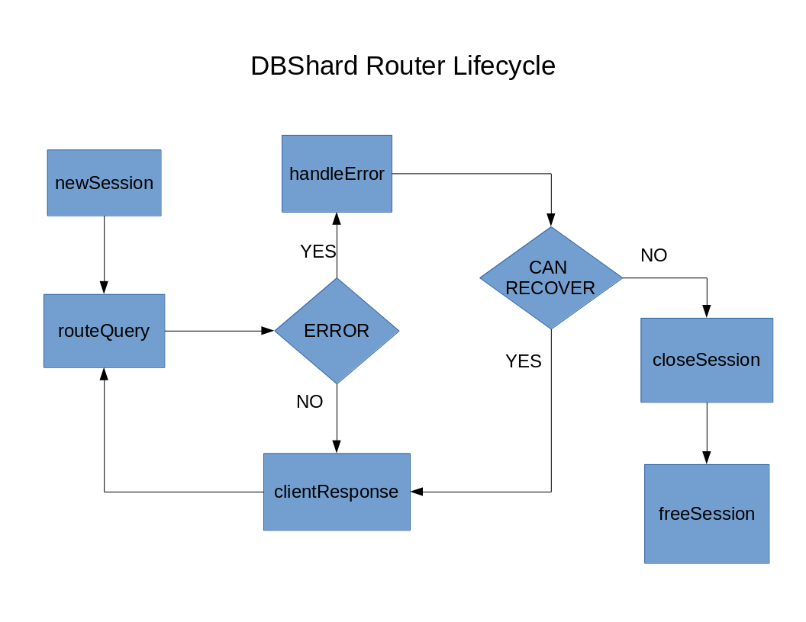

# SchemaRouter Router - Technical Overview

This document is designed with a developer's point-of-view in mind. It explains the lifecycle of the module and details about its internal workings. It refers to the source code which can be found at [GitHub](https://github.com/mariadb-corporation/MaxScale).

## Source Files and Data Structures

The schemarouter router consists of the schemarouter.h header file located in the `server/modules/include/` directory and the schemarouter.c file located in the `server/modules/routing/schemarouter` directory. This router implements the router interface defined in the router.h file. The entry points and structures this router uses can be found in the header file. The two main structures in use are the router instance and router session structures. The router instance structure is defined in `struct router_instance` and the router session structure in `struct router_client_session`.

The definitions of the external functions and all the internal functions of the router can be found in the schemarouter.c file.

## Router Lifecycle

When MaxScale first starts, it creates all services and thus creates the router instances of all the routers. The functions involved in this stage are ModuleInit, which is called only once when MaxScale first starts,  and createInstance, called for each individual instance of this router in all the configured services. These functions read configuration values and initialize internal data.

When a user connects to MaxScale, a new session is created and the newSession function is called. At this point the client session connects to all the backend servers and initializes the list of databases.

After the session is created queries are routed to the router's routeQuery function. This is where most of the work regarding the resolution of query destinations is done. This router parses the incoming buffers for full SQL packets first and routes each of them individually. The main internal functions involved in routing the query are get_shard_route_target (detects if a query needs to be sent to all the servers or to a specific one), get_shard_target_name (parses the query and finds the name of the right server) and route_session_write (handles sending and and storing session commands). After this point the client's query has been sent to the backend server and the router waits for either an response or an error signaling that the backend server is not responding.

If a response is received the clientReply function is called and response is simply sent to the client and the router is then ready for more queries. If there is no response from the server and the connection to it is lost the handleError function is called. This function tries to find replacement servers for the failed ones and regenerates the list of databases. This also triggers the sending of an error packet to the client that notifies that the server is not responding.

After the session ends the closeSession is called where the session is set to a closed state after which the freeSession is called where the final freeing of memory is done. After this point the router's session has gone through all the stages of its lifecycle.

