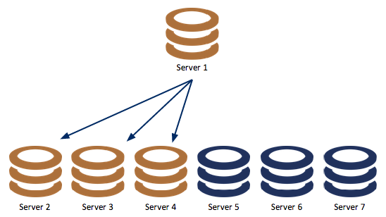

# MaxScale Configuration & Usage Scenarios

## Introduction

The purpose of this document is to describe how to configure MaxScale and to discuss some possible usage scenarios for MaxScale. MaxScale is designed with flexibility in mind, and consists of an event processing core with various support functions and plugin modules that tailor the behavior of the MaxScale itself.

### Terms


|        Term       |    Description
------------------- | ------------------
           service | A service represents a set of databases with a specific access mechanism that is offered to clients of MaxScale. The access mechanism defines the algorithm that MaxScale will use to direct particular requests to the individual databases.
            server | A server represents an individual database server to which a client can be connected via MaxScale.
            router | A router is a module within MaxScale that will route client requests to the various database servers which MaxScale provides a service interface to.
connection routing | Connection routing is a method of handling requests in which MaxScale will accept connections from a client and route data on that connection to a single database using a single connection. Connection based routing will not examine individual requests on a connection and it will not move that connection once it is established.
statement routing  | Statement routing is a method of handling requests in which each request within a connection will be handled individually. Requests may be sent to one or more servers and connections may be dynamically added or removed from the session.
          protocol | A protocol is a module of software that is used to communicate with another software entity within the system. MaxScale supports the dynamic loading of protocol modules to allow for increased flexibility.
            module | A module is a separate code entity that may be loaded dynamically into MaxScale to increase the available functionality. Modules are implemented as run-time loadable shared objects.
           monitor | A monitor is a module that can be executed within MaxScale to monitor the state of a set of database. The use of an internal monitor is optional, monitoring may be performed externally to MaxScale.
          listener | A listener is the network endpoint that is used to listen for connections to MaxScale from the client applications. A listener is associated to a single service, however a service may have many listeners.
connection failover| When a connection currently being used between MaxScale and the database server fails a replacement will be automatically created to another server by MaxScale without client intervention
  backend database | A term used to refer to a database that sits behind MaxScale and is accessed by applications via MaxScale.
            filter | A module that can be placed between the client and the MaxScale router module. All client data passes through the filter module and may be examined or modified by the filter modules.  Filters may be chained together to form processing pipelines.


## Configuration

The MaxScale configuration is read from a file which can be located in a number of placing, MaxScale will search for the configuration file in a number of locations.

1. Location given with the --configdir=<path> command line argument

2. MaxScale will look for a configuration file called `maxscale.cnf` in the directory `/etc/maxscale.cnf`

An explicit path to a configuration file can be passed by using the `-f` option to MaxScale.

The configuration file itself is based on the ".ini" file format and consists of various sections that are used to build the configuration, these sections define services, servers, listeners, monitors and global settings.

Please see the section about [Protocol Modules](#protocol-modules) for more details about MaxScale and the default directories where modules will be searched for.

### Global Settings

The global settings, in a section named `[MaxScale]`, allow various parameters that affect MaxScale as a whole to be tuned. Currently the only setting that is supported is the number of threads to use to handle the network traffic. MaxScale will also accept the section name of `[gateway]` for global settings. This is for backward compatibility with versions prior to the naming of MaxScale.

#### `threads`

To control the number of threads that poll for network traffic set the parameter threads to a number. It is recommended that you start with a single thread and add more as you find the performance is not satisfactory. MaxScale is implemented to be very thread efficient, so a small number of threads is usually adequate to support reasonably heavy workloads.  Adding more threads may not improve performance and can consume resources needlessly.

```
# Valid options are:
#       threads=<number of epoll threads>

[MaxScale]
threads=1
```

It should be noted that additional threads will be created to execute other internal services within MaxScale. This setting is used to configure the number of threads that will be used to manage the user connections.

#### `ms_timestamp`

Enable or disable the high precision timestamps in logfiles. Enabling this adds millisecond precision to all logfile timestamps.

```
# Valid options are:
#       ms_timestamp=<0|1>
ms_timestamp=1
```

#### `log_messages`

Enable or disable logging of status messages. This logfile is enabled by default and contains information about the modules MaxScale is using and details about the configuration.

```
# Valid options are:
#       log_messages=<0|1>
log_messages=1
```

To disable the log use the value 0 and to enable it use the value 1.

#### `log_trace`

Enable or disable logging of tracing messages. This logfile is disabled by default due to the verbose nature of it. It contains information about the internal logic of MaxScale and the modules it is using. The trace log can be used to find out the reasons why some actions were done e.g routing a query to a master instead of a slave.

```
# Valid options are:
#       log_trace=<0|1>
log_trace=1
```

To disable the log use the value 0 and to enable it use the value 1.

#### `log_debug`

Enable or disable logging of debugging messages. This logfile is disabled by default since it contains information only useful to the developers.

```
# Valid options are:
#       log_debug=<0|1>
log_debug=1
```

To disable the log use the value 0 and to enable it use the value 1.

#### `logdir`

Set the directory where the logfiles are stored. The folder needs to be both readable and writable by the user running MaxScale.

```
logdir=/tmp/
```

#### `datadir`

Set the directory where the data files used by MaxScale are stored. Modules can write to this directory and for example the binlogrouter uses this folder as the default location for storing binary logs.

```
datadir=/home/user/maxscale_data/
```

#### `libdir`

Set the directory where MaxScale looks for modules. The library director is the only directory that MaxScale uses when it searches for modules. If you have custom modules for MaxScale, make sure you have them in this folder.

```
libdir=/home/user/lib64/
```

#### `cachedir`

Configure the directory MaxScale uses to store cached data. An example of cached data is the authentication data fetched from the backend servers. MaxScale stores this in case a connection to the backend server is not possible.

```
cachedir=/tmp/maxscale_cache/
```

#### `piddir`

Configure the directory for the PID file for MaxScale. This file contains the Process ID for the running MaxScale process.

```
piddir=/tmp/maxscale_cache/
```

#### `language`

Set the folder where the errmsg.sys file is located in. MaxScale will look for the errmsg.sys file installed with MaxScale from this folder.

```
language=/home/user/lang/
```

### Service

A service represents the database service that MaxScale offers to the clients. In general a service consists of a set of backend database servers and a routing algorithm that determines how MaxScale decides to send statements or route connections to those backend servers.

A service may be considered as a virtual database server that MaxScale makes available to its clients.

Several different services may be defined using the same set of backend servers. For example a connection based routing service might be used by clients that already performed internal read/write splitting, whilst a different statement based router may be used by clients that are not written with this functionality in place. Both sets of applications could access the same data in the same databases.

A service is identified by a service name, which is the name of the configuration file section and a type parameter of service

```
[Test Service]
type=service
```

In order for MaxScale to forward any requests it must have at least one service defined within the configuration file. The definition of a service alone is not enough to allow MaxScale to forward requests however, the service is merely present to link together the other configuration elements.

#### `router`

The router parameter of a service defines the name of the router module that will be used to implement the routing algorithm between the client of MaxScale and the backend databases. Additionally routers may also be passed a comma separated list of options that are used to control the behavior of the routing algorithm. The two parameters that control the routing choice are router and router_options. The router options are specific to a particular router and are used to modify the behavior of the router. The read connection router can be passed options of master, slave or synced, an example of configuring a service to use this router and limiting the choice of servers to those in slave state would be as follows.

```
router=readconnroute
router_options=slave
```

To change the router to connect on to servers in the  master state as well as slave servers, the router options can be modified to include the master state.

```
router=readconnroute
router_options=master,slave
```

A more complete description of router options and what is available for a given router is included with the documentation of the router itself.

#### `filters`

The filters option allow a set of filters to be defined for a service; requests from the client are passed through these filters before being sent to the router for dispatch to the backend server.  The filters parameter takes one or more filter names, as defined within the filter definition section of the configuration file. Multiple filters are separated using the | character.

```
filters=counter | QLA
```

The requests pass through the filters from left to right in the order defined in the configuration parameter.

#### `servers`

The servers parameter in a service definition provides a comma separated list of the backend servers that comprise the service. The server names are those used in the name section of a block with a type parameter of server (see below).

```
servers=server1,server2,server3
```

#### `user`

The user parameter, along with the passwd parameter are used to define the credentials used to connect to the backend servers to extract the list of database users from the backend database that is used for the client authentication.

```
user=maxscale
passwd=Mhu87p2D
```

Authentication of incoming connections is performed by MaxScale itself rather than by the database server to which the client is connected. The client will authenticate itself with MaxScale, using the username, hostname and password information that MaxScale has extracted from the backend database servers. For a detailed discussion of how this impacts the authentication process please see the "Authentication" section below.

The host matching criteria is restricted to IPv4, IPv6 will be added in a future release.

Existing user configuration in the backend databases must be checked and may be updated before successful MaxScale authentication:

In order for MaxScale to obtain all the data it must be given a username it can use to connect to the database and retrieve that data. This is the parameter that gives MaxScale the username to use for this purpose.

The account used must be able to select from the mysql.user table, the following is an example showing how to create this user.

```
MariaDB [mysql]> create user 'maxscale'@'maxscalehost' identified by 'Mhu87p2D';
Query OK, 0 rows affected (0.01 sec)

MariaDB [mysql]> grant SELECT on mysql.user to 'maxscale'@'maxscalehost';
Query OK, 0 rows affected (0.00 sec)
```

Additionally, `GRANT SELECT` on the `mysql.db` table and `SHOW DATABASES` privileges are required in order to load databases name and grants suitable for database name authorization.

```
MariaDB [(none)]> GRANT SELECT ON mysql.db TO 'username'@'maxscalehost';
Query OK, 0 rows affected (0.00 sec)

MariaDB [(none)]> GRANT SHOW DATABASES ON *.* TO 'username'@'maxscalehost';
Query OK, 0 rows affected (0.00 sec)
```

#### `passwd`

The passwd parameter provides the password information for the above user and may be either a plain text password or it may be an encrypted password.  See the section on encrypting passwords for use in the MaxScale.cnf file. This user must be capable of connecting to the backend database and executing these SQL statements to load database names and grants from the backends:

* `SELECT user, host, password,Select_priv FROM mysql.user`.
* `SELECT user, host, db FROM mysql.db`
* `SELECT * FROM INFORMATION_SCHEMA.SCHEMATA`
* `SELECT GRANTEE,PRIVILEGE_TYPE FROM INFORMATION_SCHEMA.USER_PRIVILEGES`

#### `enable_root_user`

This parameter controls the ability of the root user to connect to MaxScale and hence onwards to the backend servers via MaxScale.

The default value is `0`, disabling the ability of the root user to connect to MaxScale.

Example for enabling root user:

```
enable_root_user=1
```

Values of `on` or `true` may also be given to enable the root user and `off` or `false` may be given to disable the use of the root user.

```
enable_root_user=true
```

#### `localhost_match_wildcard_host`

This parameter enables matching of "127.0.0.1" (localhost) against "%" wildcard host for MySQL protocol authentication. The default value is `0`, so in order to authenticate a connection from the same machine as the one on which MaxScale is running, an explicit user@lcoalhost entry will be required in the MySQL user table.

#### `version_string`

This parameter sets a custom version string that is sent in the MySQL Handshake from MaxScale to clients.

Example:

```
version_string=5.5.37-MariaDB-RWsplit
```

If not set, the default value is the server version of the embedded MySQL/MariaDB library. Example: 5.5.35-MariaDB

#### `weightby`

The weightby parameter is used in conjunction with server parameters in order to control the load balancing applied in the router in use by the service. This allows varying weights to be applied to each server to create a non-uniform distribution of the load amongst the servers.

An example of this might be to define a parameter for each server that represents the amount of resource available on the server, we could call this serversize. Every server should then have a serversize parameter set for the server.

```
serversize=10
```

The service would then have the parameter weightby set. If there are 4 servers defined in the service, serverA, serverB, serverC and serverD, with the serversize set as shown in the table below, the connections would balanced using the percentages in this table.

 Server  |serversize|% connections
---------|----------|-------------
serverA  |   10     |     18%
serverB  |   15     |     27%
serverC  |   10     |     18%
serverD  |   20     |     36%

#### `auth_all_servers`

This parameter controls whether only a single server or all of the servers are used when loading the users from the backend servers. This takes a boolean value and when enabled, creates a union of all the users and grants on all the servers.

#### `strip_db_esc`

The strip_db_esc parameter strips escape characters from database names of grants when loading the users from the backend server. Some visual database management tools automatically escape some characters and this might cause conflicts when MaxScale tries to authenticate users.

This parameter takes a boolean value and when enabled, will strip all `\` characters from the database names.

#### `optimize_wildcard`

Enabling this feature will transform wildcard grants to individual database grants. This will consume more memory but authentication in MaxScale will be done faster. The parameter takes a boolean value.

#### `connection_timeout`

The connection_timeout parameter is used to disconnect sessions to MaxScale that have been idle for too long. The session timeouts are disabled by default. To enable them, define the timeout in seconds in the service's configuration section.

Example:

```
[Test Service]
connection_timeout=300
```

### Server

Server sections are used to define the backend database servers that can be formed into a service. A server may be a member of one or more services within MaxScale. Servers are identified by a server name which is the section name in the configuration file. Servers have a type parameter of server, plus address port and protocol parameters.

```
[server1]
type=server
address=127.0.0.1
port=3000
protocol=MySQLBackend
```

#### `address`

The IP address or hostname of the machine running the database server that is being defined. MaxScale will use this address to connect to the backend database server.

#### `port`

The port on which the database listens for incoming connections. MaxScale will use this port to connect to the database server.

#### `protocol`

The name for the protocol module to use to connect MaxScale to the database. Currently only one backend protocol is supported, the MySQLBackend module.

#### `monitoruser`

The monitor has a username and password that is used to connect to all servers for monitoring purposes, this may be overridden by supplying a monitoruser statement for each individual server

```
monitoruser=mymonitoruser
```

#### `monitorpw`

The monitor has a username and password that is used to connect to all servers for monitoring purposes, this may be overridden by supplying a monpasswd statement for the individual servers

```
monitorpw=mymonitorpasswd
```

The monpasswd parameter may be either a plain text password or it may be an encrypted password.  See the section on encrypting passwords for use in the MaxScale.cnf file.

### Listener

The listener defines a port and protocol pair that is used to listen for connections to a service. A service may have multiple listeners associated with it, either to support multiple protocols or multiple ports. As with other elements of the configuration the section name is the listener name and it can be selected freely. A type parameter is used to identify the section as a listener definition. Address is optional and it allows the user to limit connections to certain interface only. Socket is also optional and used for Unix socket connections.

```
[<Listener name>]
type=listener
service=<Service name>]
protocol=[MySQLClient|HTTPD]
address=[IP|hostname]
port=<Listen port number>
socket=<Socket path>
```

#### `service`

The service to which the listener is associated. This is the name of a service that is defined elsewhere in the configuration file.

#### `protocol`

The name of the protocol module that is used for the communication between the client and MaxScale itself.

#### `address`

The address option sets the address that will be used to bind the listening socket. The address may be specified as an IP address in 'dot notation' or as a hostname. If the address option is not included in the listener definition the listener will bind to all network interfaces.

#### `port`

The port to use to listen for incoming connections to MaxScale from the clients. If the port is omitted from the configuration a default port for the protocol will be used.

#### `socket`

The `socket` option may be included in a listener definition, this configures the listener to use Unix domain sockets to listen for incoming connections. The parameter value given is the name of the socket to use.

If a socket option and an address option is given then the listener will listen on both the specific IP address and the Unix socket.

### Filter

Filters provide a means to manipulate or process requests as they pass through MaxScale between the client side protocol and the query router. A filter should be defined in a section with a type of filter.

```
[QLA]
type=filter
module=qlafilter
options=/tmp/QueryLog
```

The section name may then be used in one or more services by using the filters= parameter in the service section. In order to use the above filter for a service called "QLA Service", an entry of the following form would exist for that service.

```
[QLA Service]
type=service
router=readconnroute
router_options=slave
servers=server1,server2,server3,server4
user=massi
passwd=6628C50E07CCE1F0392EDEEB9D1203F3
filters=QLA
```


See the Services section for more details on how to configure the various options of a service. Note that some filters require parsing of the statement which makes them compatible with statement-based routers only, such as Read/Write Split router.

#### `module`

The module parameter defines the name of the loadable module that implements the filter.

#### `options`

The options parameter is used to pass options to the filter to control the actions the filter will perform. The values that can be passed differ between filter implementation, the inclusion of an options parameter is optional.

#### Other Parameters

Any other parameters present in the filters section will be passed to the filter to be interpreted by the filter. An example of this is the regexfilter that requires the two parameters `match` and `replace`:

```
[regex]
type=filter
module=regexfilter
match=form
replace=from
```

### Monitor

In order for the various router modules to function correctly they require information about the state of the servers that are part of the service they provide. MaxScale has the ability to internally monitor the state of the back-end database servers or that state may be feed into MaxScale from external monitoring systems. If automated monitoring and failover of services is required this is achieved by running a monitor module that is designed for the particular database architecture that is in use.

Monitors are defined in much the same way as other elements in the configuration file, with the section name being the name of the monitor instance and the type being set to monitor.

This is an example configuration of the MySQL monitor module. It is intended for Master-Slave replication clusters and allows for replication lag detection.

```
[MySQL Monitor]
type=monitor
module=mysqlmon
servers=server1,server2,server3
user=dbmonitoruser
passwd=dbmonitorpwd
monitor_interval=8000
backend_connect_timeout=3
backend_read_timeout=1
backend_write_timeout=2

# mysqlmon specific options
detect_replication_lag=0
detect_stale_master=0
```

Here is an example configuration of the Galera cluster monitor. It detects when nodes are in sync and also assigns master and slave roles to nodes within MaxScale, allowing it to be used with modules designed for Master-Slave replication clusters.

```
[Galera Monitor]
type=monitor
module=galeramon
servers=server1,server2,server3
user=dbmonitoruser
passwd=dbmonitorpwd
monitor_interval=8000
backend_connect_timeout=3
backend_read_timeout=1
backend_write_timeout=2

# galeramon specific options
disable_master_failback=0
available_when_donor=0
disable_master_role_setting=0
```

#### `module`

The module parameter defines the name of the loadable module that implements the monitor. This module is loaded and executed on a separate thread within MaxScale.

#### `servers`

The servers parameter is a comma separated list of server names to monitor, these are the names defined elsewhere in the configuration file. The set of servers monitored by a single monitor need not be the same as the set of servers used within any particular server, a single monitor instance may monitor servers in multiple servers.

Multiple monitors monitoring the same servers should be avoided. They can possibly make the whole cluster inoperable and a good example is the mixed use of the MySQL and the Galera monitors. The MySQL monitor requires a working Master-Slave replication for it to assign the Master and Slave roles inside MaxScale but the Galera monitor only looks for Galera specific status variables. These two monitors will cause a conflict when one tries to clear server states it sees as valid while the other is simultaneously setting new states to the rest of the servers.

#### `user`

The user parameter defines the username that the monitor will use to connect to the monitored databases. Depending on the monitoring module used this user will require specific privileges in order to determine the state of the nodes, details of those privileges can be found in the sections on each of the monitor modules.

Individual servers may define override values for the user and password the monitor uses by setting the monuser and monpasswd parameters in the server section.

#### `passwd`

The password parameter may be either a plain text password or it may be an encrypted password. See the section on encrypting passwords for use in the `MaxScale.cnf` file.

#### `monitor_interval`

The monitor_interval parameter sets the sampling interval in milliseconds for each monitor, the default value is 10000 milliseconds.

#### `detect_replication_lag`

This options if set to 1 will allow MySQL monitor to collect the replication lag among all configured slaves by checking the content of `maxscale_schema.replication_heartbeat` table. The master server writes in and slaves fetch a UNIX timestamp from that there.

This timestamp, evaluated in seconds, is updated in each node server struct and it's used to calculate the replication lag.

That value is also used by the Read / Write split module via `max_slave_replication_lag` and `LEAST_BEHIND_MASTER` options.

Replication lag is measured by writing to a table, replication_heartbeat in the maxscale_schema, updates to this table will be observed on the slave in order to determine the lag between the slave and the master on which it was written. If the slave is many minutes behind the master and MaxScale is then started the information in the slave table is not available and that slave may be excluded from the routing decision.

A specific grant for the monitor user might be required in order to create schema/table and for read/write operations.

This monitor option is not enabled by default.

#### `detect_stale_master`

This options if set to 1 will allow MySQL monitor to select the previous selected Master for next operations even if no slaves at all are found by the monitor polling.

This is such a case when the replication on all slave has been stopped via `STOP SLAVE` or the current configuration was removed by `RESET SLAVE ALL`.

As there are no slaves the replication topology cannot be computed and MaxScale can only check if the current monitored server was the master before: if that's the case

MySQL monitor adds to the server status field the `SERVER_STALE_STATUS` bit and a log entry appears in the Message Log file.

If MaxScale or monitor is restarted and the Replication is still not configured or started there will not be any master server available even with this option enabled.

This option is not enabled by default and should be used at the administrator risk.

#### `disable_master_failback`

This option if set to 1 will allow Galera monitor to keep the existing selected master even if another node, after joining back the cluster may be selected as candidate master.

The master role assignment currently follows one rule: take the server with lowest `wsrep_local_index` value.

By default, if a node takes a lower index than the current master one the monitor will set the master role to that node: this monitor option, if set, prevents the master change.

The server status field may have the `SERVER_MASTER_STICKINESS` bit, meaning the current master selection is not based on the available rules but it's the one previously selected and then kept, accordingly to option value equal 1.

Anyway, a new master will be selected in case of current master failure, regardless the option value.

#### `available_when_donor`

This option if set to 1 will allow Galera monitor to keep a node in `Donor` status in the server pool if it is using any xtrabackup method for SST, e.g. `wsrep_sst_method` equal to `xtrabackup` or `xtrabackup-v2`.

As xtrabackup is a non-locking SST method, a node in `Donor` status can still be considered in sync. This option is not enabled by default and should be used as the administrator's discretion.

#### `disable_master_role_setting`

This option if set to 1 will stop the Galera monitor from setting the status of
backend servers to master or slave.  It is applicable when the Galera router is
being used to spread writes across multiple nodes, so that no server is to be
nominated as the master.

#### `backend_connect_timeout`

This option, with default value of `3` sets the monitor connect timeout to backends.

#### `backend_read_timeout`

Default value is `1`. Read Timeout is the timeout in seconds for each attempt to read from the server. There are retries if necessary, so the total effective timeout value is three times the option value. That's for `mysql_real_connect` C API.

#### `backend_write_timeout`

Default value is `2`. Write Timeout is the timeout in seconds for each attempt to write to the server. There is a retry if necessary, so the total effective timeout value is two times the option value. That's for `mysql_real_connect` C API.

## Protocol Modules

The protocols supported by MaxScale are implemented as external modules that are loaded dynamically into the MaxScale core. These modules reside in the directory `/usr/lib64/maxscale`. The location can be overridden with the `libdir=PATH` parameter under the `[maxscale]` section. It may also be set by passing the `-B PATH` or `--libdir=PATH` option on the MaxScale command line.

### MySQLClient

This is the implementation of the MySQL protocol that is used by clients of MaxScale to connect to MaxScale.

### MySQLBackend

The MySQLBackend protocol module is the implementation of the protocol that MaxScale uses to connect to the backend MySQL, MariaDB and Percona Server databases. This implementation is tailored for the MaxScale to MySQL Database traffic and is not a general purpose implementation of the MySQL protocol.

### telnetd

The telnetd protocol module is used for connections to MaxScale itself for the purposes of creating interactive user sessions with the MaxScale instance itself. Currently this is used in conjunction with a special router implementation, the debugcli.

### maxscaled

The protocol used used by the maxadmin client application in order to connect to MaxScale and access the command line interface.

### HTTPD

This protocol module is currently still under development, it provides a means to create HTTP connections to MaxScale for use by web browsers or RESTful API clients.

## Router Modules

The main task of MaxScale is to accept database connections from client applications and route the connections or the statements sent over those connections to the various services supported by MaxScale.

There are two flavors of routing that MaxScale can perform, connection based routing and statement based routine. These each have their own characteristics and costs associated with them.

### Connection Based Routing

Connection based routing is a mechanism by which MaxScale will, for each incoming connection decide on an appropriate outbound server and will forward all statements to that server without examining the internals of the statement. Once an inbound connection is associated to a particular backend database it will remain connected to that server until the connection is closed or the server fails. The Read Connection Router is an example of connection-based routing.

### Statement Based Routing

Statement based routing is somewhat different, the routing modules examine every statement the client sends and determines, on a per statement basis, which of the set of backend servers in the service is best to execute the statement. This gives better dynamic balancing of the load within the cluster but comes at a cost. The query router must understand the statement that is being routed and may have to parse the statement in order to achieve this.

Parsing within the router adds overhead to the cost of routing and makes this type of router best suitable for loads in which the gains outweigh this added cost. The added cost from statement parsing also gives the possibility to create and use new type of filters which are based on statement processing. In contrast to the added processing cost, statement-based routing may increase the performance of the cluster by offloading statements away from the master when possible.

### Available Routing Modules

Currently a small number of query routers are available, these are in different stages of completion and offer different facilities.

#### Readconnroute

This is a connection based query router that was originally targeted at environments in which the clients already performed splitting of read and write queries into separate connections.

Whenever a new connection is received the router will examine the state of all the servers that form part of the service and route the connection to the server with least connections currently that matches the filter constraints given in the router options. This results in a balancing of the active connections, however different connections may have different lifetimes and the connections may become unbalanced when later viewed.

The read connection router can be configured to balance the connections from the clients across all the backend servers that are running, just those backend servers that are currently replication slaves or those that are replication masters when routing to a master slave replication environment. When a Galera cluster environment is in use the servers can be filtered to just the set that are part of the cluster and in the _Synced_ state. These options are configurable via the router_options that can be set within a service. The `router_option` values supported are `master`, `slave` and `synced`.

##### Master/Slave Replication Setup

To set up MaxScale to route connections evenly between all the current slave servers in a replication cluster, a service entry of the form shown below is required:

```
[Read Service]
type=service
router=readconnroute
router_options=slave
servers=server1,server2,server3,server4
user=maxscale
passwd=thepasswd
```

And then add a listener for this service, which defines the port and protocol that MaxScale uses:

```
[Read Listener]
type=listener
service=Read Service
protocol=MySQLClient
port=4006
```

The client can now connect to port 4006 on the host where MaxScale runs. Statements sent using this connection will then be routed to one of the slaves in the server set defined in the Read Service. Exactly which is selected will be determined by balancing the number of connections to each of those whose current state is *Slave*.

Altering `router_options` to be `slave,master` would result in the connections being balanced between all the servers within the cluster.

It is assumed that the client will have a separate connection to the master server, however this can be routed via MaxScale, allowing MaxScale to designate which server is master. To do this you would add a second service and listener definition for the master server.

```
[Write Service]
type=service
router=readconnroute
router_options=master
servers=server1,server2,server3,server4
user=maxscale
passwd=thepasswd

[Write Listener]
type=listener
service=Write Service
protocol=MySQLClient
port=4007
```

This allows the clients to direct write requests to port 4007 and read requests to port 4006 of the MaxScale host without the clients needing to understand the configuration of the Master/Slave replication cluster.

Connections to port 4007 would automatically be directed to the server that is the master for replication at the time connection is opened. Whilst this is a simple mapping to a single server it does give the advantage that the clients have no requirement to track which server is currently the master, devolving responsibility for managing the failover to MaxScale.

In order for MaxScale to be able to determine the state of these servers the **mysqlmon** monitor module should be run against the set of servers that comprise the service.

##### Galera Cluster Configuration for Read Connection router

Although not primarily designed for a multi-master replication setup, it is possible to use **readconnroute** in this situation.  The **readconnroute** connection router can be used to balance the connections across a Galera cluster. A special monitor is available that detects if nodes are joined to a Galera Cluster, with the addition of a router option to only route connections to nodes marked as synced. MaxScale can ensure that users are never connected to a node that is not a full cluster member.

```
[Galera Service]
type=service
router=readconnroute
router_options=synced
servers=server1,server2,server3,server4
user=maxscale
passwd=thepasswd

[Galera Listener]
type=listener
service=Galera Service
protocol=MySQLClient
port=3336

[Galera Monitor]
type=monitor
module=galeramon
servers=server1,server2,server3,server4
user=galeramon
passwd=galeramon
```

The specialized Galera monitor can also select one of the node in the cluster as _Master_, the others will be marked as _Slave_. These roles are only assigned to _Synced_ nodes.

It then possible to have services/listeners with `router_options=master` or `slave` accessing a subset of all Galera nodes. The _Synced_ state simply means: access all nodes. Examples of different **readconn** router configurations for Galera:

```
[Galera Master Service]
type=service
router=readconnroute
router_options=master

[Galera Slave Service]
type=service
router=readconnroute
router_options=slave
```

##### MySQL Cluster Configuration for Read Connection router

The **readconnroute** connection router can be used to balance the connections across a MySQL cluster SQL nodes. A special monitor is available that detects if SQL nodes are connected to data nodes, with the addition of a router option to only route connections to nodes marked as NDB.
MaxScale can ensure that users are never connected to a node that is not a full cluster member.

```
[NDB Cluster Monitor]
type=monitor
module=ndbclustermon
servers=server1,server2
user=monitor
passwd=monitor

[MySQL Cluster Service]
type=service
router=readconnroute
router_options=ndb
servers=server1,server2

[Cluster Listener]
type=listener
service=MySQL Cluster Service
protocol=MySQLClient
port=4906
```

The `ndb` router option simply means: access all SQL nodes marked with NDB status, i.e. they are members of the cluster.

#### Read/Write Split Router

The Read/Write Split Router is implemented in readwritesplit module. It is a statement-based router that has been designed for use within Master/Slave replication environments. It examines and optionally parses every statement to find out whether the statement can be routed to slave instead of master.

##### Starting a readwritesplit router session

When client connects to readwritesplit service for the first time, client is authenticated against user data loaded from backend database. After successful authentication connection for client queries is created and followed by that, a readwritesplit router session is initialized.

Router session processes its specific configuration parameters and establishes connections to master and slaves. The number of slaves in each session depends on the value of `max_slave_connections` parameter (default is `1`) and the availability of slaves. Most suitable number of slaves varies as it depends on the number of clients, and the backend servers and the type of load. In Figure below Server 1 is the master and Servers 2-7 are the available slaves. In this example `max_slave_connections=3`.



##### Routing to *Master*

Routing to master is important for data consistency and because majority of writes are written to binlog and thus become replicated to slaves.

The following operations are routed to master:

* write statements,
* all statements within an open transaction,
* stored procedure calls, and
* user-defined function calls.
* DDL statements (`DROP`|`CREATE`|`ALTER TABLE` … etc.)
* `EXECUTE` (prepared) statements
* all statements using temporary tables

In addition to these, if the **readwritesplit** service is configured with the `max_slave_replication_lag` parameter, and if all slaves suffer from too much replication lag, then statements will be routed to the _Master_. (There might be other similar configuration parameters in the future which limit the number of statements that will be routed to slaves.)

##### Routing to *Slave*s

The ability to route some statements to *Slave*s is important because it also decreases the load targeted to master. Moreover, it is possible to have multiple slaves to share the load in contrast to single master.

Queries which can be routed to slaves must be auto committed and belong to one of the following group:

* read-only database queries,
* read-only queries to system, or user-defined variables,
* `SHOW` statements, and
* system function calls.

##### Routing to every session backend

A third class of statements includes those which modify session data, such as session system variables, user-defined variables, the default database, etc. We call them session commands, and they must be replicated as they affect the future results of read and write operations, so they must be executed on all servers that could execute statements on behalf of this client.

Session commands include for example:

* `SET` statements
* `USE `*`<dbname>`*
* system/user-defined variable assignments embedded in read-only statements, such as `SELECT (@myvar := 5)`
* `PREPARE` statements
* `QUIT`, `PING`, `STMT RESET`, `CHANGE USER`, etc. commands

**NOTE: if variable assignment is embedded in a write statement it is routed to _Master_ only. For example, `INSERT INTO t1 values(@myvar:=5, 7)` would be routed to _Master_ only.**

The router stores all of the executed session commands so that in case of a slave failure, a replacement slave can be chosen and the session command history can be repeated on that new slave. This means that the router stores each executed session command for the duration of the session. Applications that use long-running sessions might cause MaxScale to consume a growing amount of memory unless the sessions are closed. This can be solved by setting a connection timeout on the application side.

##### Configuring the Read/Write Split router

Read/Write Split router-specific settings are specified in the configuration file of MaxScale in its specific section. The section can be freely named but the name is used later as a reference from listener section.

The configuration consists of mandatory and optional parameters.

###### Mandatory parameters

**`type`** specifies the type of service. For **readwritesplit** module the type is `router`:

    type=router

**`service`** specifies the router module to be used. For **readwritesplit** the value is `readwritesplit`:

    service=readwritesplit

**`servers`** provides a list of servers, which must include one master and available slaves:

    servers=server1,server2,server3

**NOTE: Each server on the list must have its own section in the configuration file where it is defined.**

**`user`** is the username the router session uses for accessing backends in order to load the content of the `mysql.user` table (and `mysql.db` and database names as well) and optionally for creating, and using `maxscale_schema.replication_heartbeat` table.

**`passwd`** specifies corresponding password for the user. Syntax for user and passwd is:

```
user=<username>
passwd=<password>
```

###### Optional parameters

**`max_slave_connections`** sets the maximum number of slaves a router session uses at any moment. Default value is `1`.

	max_slave_connections=<max. number, or % of available slaves>

**`max_slave_replication_lag`** specifies how many seconds a slave is allowed to be behind the master. If the lag is bigger than configured value a slave can't be used for routing.

	max_slave_replication_lag=<allowed lag in seconds>

This applies to Master/Slave replication with MySQL monitor and `detect_replication_lag=1` options set.
Please note max_slave_replication_lag must be greater than monitor interval.

**`router_options`** may include multiple **readwritesplit**-specific options. Values are either singular or parameter-value pairs. Currently available is a single option which specifies the criteria used in slave selection both in initialization of router session and per each query. Note that due to the current monitor implementation, the value specified here should be *<twice the monitor interval>* + 1.

	options=slave_selection_criteria=<criteria>

where *<criteria>* is one of the following:

* `LEAST_GLOBAL_CONNECTIONS`, the slave with least connections in total
* `LEAST_ROUTER_CONNECTIONS`, the slave with least connections from this router
* `LEAST_BEHIND_MASTER`, the slave with smallest replication lag
* `LEAST_CURRENT_OPERATIONS` (default), the slave with least active operations

**`use_sql_variables_in`** specifies where should queries, which read session variable, be routed. The syntax for `use_sql_variable_in` is:

    use_sql_variables_in=[master|all]

When value all is used, queries reading session variables can be routed to any available slave (depending on selection criteria). Note, that queries modifying session variables are routed to all backend servers by default, excluding write queries with embedded session variable modifications, such as:

    INSERT INTO test.t1 VALUES (@myid:=@myid+1)

In above-mentioned case the user-defined variable would only be updated in the master where query would be routed due to `INSERT` statement.

**`max_sescmd_history`** sets a limit on how many session commands each session can execute before the connection is closed. The default is an unlimited number of session commands.

	max_sescmd_history=1500

When a limitation is set, it effectively creates a cap on the session's memory consumption. This might be useful if connection pooling is used and the sessions use large amounts of session commands.

**`disable_sescmd_history`** disables the session command history. This way nothing is stored and if a slave server fails and a new one is taken in its stead, the session on that server will be in an inconsistent state compared to the master server. Disabling session command history will allow connection pooling without causing a constant growth in the memory consumption.

```
# Disable the session command history
disable_sescmd_history=true
```

**`disable_slave_recovery`** disables the recovery and replacement of slave servers. If this option is enabled and a connection to a slave server in use is lost, no replacement slave will be taken. This allows the safe use of session state modifying statements when the session command history is disabled. This is mostly intended to be used with the `disable_sescmd_history` option enabled.

```
# Disable the session command history
disable_slave_recovery=true
```

An example of Read/Write Split router configuration :

```
[RWSplit Service]
type=service
router=readwritesplit
router_options=slave_selection_criteria=LEAST_BEHIND_MASTER
max_slave_connections=50%
max_slave_replication_lag=61
servers=server1,server2,server3,server4
user=myuser
passwd=mypass
filters=qla|fetch|from
```

In addition to this, readwritesplit needs configuration for a listener, for all servers listed, and for each filter. Listener, server - and filter configurations are described in their own sections in this document.

Below is a listener example for the "RWSplit Service" defined above:

```
[RWSplit Listener]
type=listener
service=RWSplit Service
protocol=MySQLClient
port=4044
```

The client would merely connect to port 4044 on the MaxScale host and statements would be directed to the master, slave or all backends as appropriate. Determination of the master or slave status may be done via a monitor module within MaxScale or externally. In this latter case the server flags would need to be set via the MaxScale debug interface, in future versions an API will be available for this purpose.

##### Galera Cluster Configuration for Read/Write Split router


Galera monitor assigns Master and Slave roles to appropriate sync'ed Galera nodes. Using **readwritesplit** with Galera is seamless; the only change needed to the configuration above is replacing the list of MySQL replication servers with list of Galera nodes. With the same example as above:

Simply configure a RWSplit Service with Galera nodes:

```
[RWSplit Service]
type=service
router=readwritesplit
max_slave_connections=50%
servers=galera_node1,galera_node2,galera_node3
user=myuser
passwd=mypass
filters=qla|fetch|from
```

#### CLI

The command line interface as used by `maxadmin`. This is a variant of the debugcli that is built slightly differently so that it may be accessed by the client application `maxadmin`. The CLI requires the use of the `maxscaled` protocol.

##### CLI Configuration

There are two components to the definition required in order to run the command line interface to use with MaxAdmin; a service and a listener.

The default entries required are shown below.

```
[CLI]
type=service
router=cli

[CLI Listener]
type=listener
service=CLI
protocol=maxscaled
address=localhost
port=6603
```

Note that this uses the default port of 6603 and confines the connections to localhost connections only. Remove the address= entry to allow connections from any machine on your network. Changing the port from 6603 will mean that you must allows pass a -p option to the MaxAdmin command.

#### Debug CLI

The **debugcli** router is a special kind of statement based router. Rather than direct the statements at an external data source they are handled internally. These statements are simple text commands and the results are the output of debug commands within MaxScale. The service and listener definitions for a debug cli service only differ from other services in that they require no backend server definitions.

##### Debug CLI Configuration

The definition of the debug cli service is illustrated below

```
[Debug Service]
type=service
router=debugcli

[Debug Listener]
type=listener
service=Debug Service
protocol=telnetd
port=4442
```

Connections using the telnet protocol to port 4442 of the MaxScale host will result in a new debug CLI session. A default username and password are used for this module, new users may be created using the add user command. As soon as any users are explicitly created the default username will no longer continue to work. The default username is admin with a password of mariadb.

The debugcli supports two modes of operation, `developer` and `user`. The mode is set via the `router_options` parameter. The user mode is more suited to end-users and administrators, whilst the develop mode is explicitly targeted to software developing adding or maintaining the MaxScale code base. Details of the differences between the modes can be found in the debugging guide for MaxScale. The default is `user` mode. The following service definition would enable a developer version of the debugcli.

```
[Debug Service]
type=service
router=debugcli
router_options=developer
```

It should be noted that both `user` and `developer` instances of debugcli may be defined within the same instance of MaxScale, however they must be defined as two distinct services, each with a distinct listener.

```
[Debug Service]
type=service
router=debugcli
router_options=developer

[Debug Listener]
type=listener
service=Debug Service
protocol=telnetd
port=4442

[Admin Service]
type=service
router=debugcli

[Admin Listener]
type=listener
service=Debug Service
protocol=telnetd
port=4242
```

## Monitor Modules

Monitor modules are used by MaxScale to internally monitor the state of the backend databases in order to set the server flags for each of those servers. The router modules then use these flags to determine if the particular server is a suitable destination for routing connections for particular query classifications. The monitors are run within separate threads of MaxScale and do not affect the MaxScale performance.

The use of monitors is optional, it is possible to run MaxScale with external monitoring, in which case arrangements must be made for an external entity to set the status of each of the servers that MaxScale can route to.

Parameters that apply to all monitors are:

* `monitor_interval`
* `backend_connect_timeout`
* `backend_read_timeout`
* `backend_write_timeout`

Other parameters are monitor specific.

### mysqlmon

The MySQLMon monitor is a simple monitor designed for use with MySQL Master/Slave replication cluster. To execute the mysqlmon monitor an entry as shown below should be added to the MaxScale configuration file.

```
[MySQL Monitor]
type=monitor
module=mysqlmon
servers=server1,server2,server3,server4
```

This will monitor the 4 servers; `server1`, `server2`, `server3` and `server4`. It will set the status of running or failed and master or slave for each of the servers.

The monitor uses the username given in the monitor section or the server specific user that is given in the server section to connect to the server. This user must have sufficient permissions on the database to determine the state of replication. The roles that must be granted to this user are `REPLICATION SLAVE` and `REPLICATION CLIENT`.

To create a user that can be used to monitor the state of the cluster, the following commands could be used,  assuming that MaxScale is running on the host 'maxscalehost'

```
MariaDB [mysql]> create user 'maxscalemon'@'maxscalehost' identified by 'Ha79hjds';
Query OK, 0 rows affected (0.01 sec)

MariaDB [mysql]> grant REPLICATION SLAVE on *.* to 'maxscalemon'@'maxscalehost';
Query OK, 0 rows affected (0.00 sec)

MariaDB [mysql]> grant REPLICATION CLIENT on *.* to 'maxscalemon'@'maxscalehost';
Query OK, 0 rows affected (0.00 sec)
```

MySQL monitor fetches the `@@server_id` variable and other informations from `SHOW SLAVE STATUS` in order to compute the replication topology tree that may include intermediate master servers, called relay servers.

The *Master* server used by router modules is the so called "root master": a server that has the `SERVER_MASTER` status bit set and it's at the lowest level of the replication depth.

MySQL monitor may optionally (`detect_replication_lag=1`) detect the replication lag among servers by using the `maxscale_schema.replication_heartbeat` table: the monitor user must have rights to create it and write into.

Another option (`detect_stale_master=1`) may also allow to set a Stale Master when the replication has been stopped or the configuration doesn't allow to have both IO and SQL replication threads running on all slaves: the previous detected working Master will be selected for read and write operations.

Please note, those two options are not enabled by default.

### galeramon

The Galeramon monitor is a simple monitor designed for use with MySQL Galera cluster. To execute the galeramon monitor an entry as shown below should be added to the MaxScale configuration file.

```
[Galera Monitor]
type=monitor
module=galeramon
servers=galera_node1,galera_node2,galera_node3
```

This will monitor the 4 servers; server1, server2, server3 and server4. It will set the status of *Running* or *Failed* and *Joined* for those servers that reported the Galera JOINED status.

To create a user that can be used to monitor the state of the cluster, the following commands could be used, assuming that MaxScale is running on the host maxscalehost.

```
MariaDB [mysql]> create user 'maxscalemon'@'maxscalehost' identified by 'Ha79hjds';
Query OK, 0 rows affected (0.01 sec)
```

The Galera monitor also assigns *Master* and *Slave* roles to the configured nodes. Among the set of synced servers, the one with the lowest value of `wsrep_local_index` is selected as the current *Master* while the others are given the role of *Slave*; that's the only available master selection rule right now.

In this way it is possible to configure the node access based not only on *Synced* state but even on *Master* and *Slave* role enabling the use of the Read/Write Split router on a Galera cluster and avoiding any possible write conflict.

It may happen that after a node failure or reboot or node joining back the cluster, the node's `wsrep_local_index` in the cluster nodes changes.  This might result in monitor assigning the *Master* role to another server.  In order to avoid such situation, the `disable_master_failback` configuration option helps keep the current master regardless of the value of `wsrep_local_index`. This option is not enabled by default.

This is an example status for a Galera server node:

```
Server 0x261fe50 (server2)

	Server:			192.168.1.101
	Status:         	Master, Synced, Running

Protocol:			MySQLBackend

Port:				3306

	Server Version:		5.5.40-MariaDB-wsrep-log
	Node Id:			0

Server 0x2d1b3c0 (server4)

	Server:			192.168.122.144
	Status:              Slave, Synced, Running
	Protocol:			MySQLBackend
	Port:				3306
	Server Version:		5.5.40-MariaDB-wsrep-log
	Node Id:			1
```

### ndbclustermon

The NDB Cluster Monitor (ndbclustermon) is a simple router designed for use with MySQL Cluster. To execute the ndclustermon monitor an entry as shown below should be added to the MaxScale configuration file.

Example for monitor section:

```
[NDB Cluster Monitor]
type=monitor
module=ndbclustermon
servers=server1,server2
```

This will monitor the two SQL nodes `server1` and `server2` and will set the status of *NDB* and *Running* or *Failed* for those servers with the value of status variable `Ndb_number_of_ready_data_nodes` greater than 0, i.e. the monitored SQL node is able to contact one or more data nodes.

Example of a monitored server:

```
	Server 0x3873a40 (server2)
		Server:			192.168.90.81
		Status:              	NDB, Running
		Protocol:			MySQLBackend
		Port:				3306
		Server Version:		5.5.38-ndb-7.2.17-cluster-gpl
		Node Id:			13
```

The MySQL Cluster variables fetched by the monitor are:

```
mysql> SHOW STATUS LIKE 'Ndb_number_of_ready_data_nodes';
+--------------------------------+-------+
+
| Variable_name                  | Value |
+--------------------------------+-------+
| Ndb_number_of_ready_data_nodes | 2     |
+--------------------------------+-------+
1 row in set (0.00 sec)
```

The result is greater than 0 so the NBD status is added to status

```
mysql> SHOW STATUS LIKE 'Ndb_cluster_node_id';
+---------------------+-------+
| Variable_name       | Value |
+---------------------+-------+
| Ndb_cluster_node_id | 13    |
+---------------------+-------+
1 row in set (0.00 sec)
```

The value is stored in `node_id` server field.

## Filter Modules

Currently four example filters are included in the MaxScale distribution

<table>
  <tr>
    <td>Module</td>
    <td>Description</td>
  </tr>
  <tr>
    <td>testfilter</td>
    <td>Statement counting Filter - a simple filter that counts the number of SQL statements executed within a session. Results may be viewed via the debug interface.</td>
  </tr>
  <tr>
    <td>qlafilter</td>
    <td>Query Logging Filter - a simple query logging filter that write all statements for a session into a log file for that session.</td>
  </tr>
  <tr>
    <td>regexfilter</td>
    <td>Query Rewrite Filter - an example of how filters can alter the query contents. This filter allows a regular expression to be defined, along with replacement text that should be substituted for every match of that regular expression.</td>
  </tr>
  <tr>
    <td>tee</td>
    <td>A filter that duplicates SQL requests and sends the duplicates to another service within MaxScale.</td>
  </tr>
  <tr>
    <td>topfilter</td>
    <td>A filter that records the top running queries in terms of execution time. The number of queries to maintain is configurable, upon completion of a session a log file is written with the details of those top queries.</td>
  </tr>
</table>


These filters are merely examples of what may be achieved with the filter API and are not sophisticated or consider as suitable for production use, they merely illustrate the functionality possible.

### Statement Counting Filter

The statement counting filter is implemented in the module names testfilter and merely keeps a count of the number of SQL statements executed. The filter requires no options to be passed and takes no parameters. The statement count can be viewed via the diagnostic and debug interface of MaxScale.

In order to add this filter to an existing service create a filter section to name the filter as follows

```
[counter]
type=filter
module=testfilter
```

Then add the filter to your service by including the filters= parameter in the service section.

    filters=counter

### Query Log All (QLA) Filter

The Query Log All Filter (qlafilter) simply writes all SQL statements to a log file along with a timestamp for the statement. An example of the file produced by the QLA filter is shown below

```
00:36:04.922 5/06/2014, select @@version_comment limit 1
00:36:12.663 5/06/2014, SELECT DATABASE()
00:36:12.664 5/06/2014, show databases
00:36:12.665 5/06/2014, show tables
```

A new file is created for each client connection, the name of the logfile can be controlled by the use of the router options. No parameters are used by the QLA filter. The filter is implemented by the loadable module qlafilter.

To add the QLA filter to a service you must create a filter section to name the filter, associated the loadable module and define the filename option.

```
[QLA]
type=filter
module=qlafilter
options=/tmp/QueryLog
```

Then add the filters= parameter into the service that you wish to log by adding this parameter to the service section

    filters=QLA

A log file will be created for each client connection, the name of that log file will be `/tmp/QueryLog.`*`<number>`*

### Regular Expression Filter

The regular expression filter is a simple text based query rewriting filter. It allows a regular expression to be used to match text in a SQL query and then a string replacement to be made against that match. The filter is implemented by the regexfilter loadable module and is passed two parameters, a match string and a replacement string.

To add the filter to your service you must first create a filter section to name the filter and give the match and replacement strings. Here we define a filter that will convert to MariaDB 10 command show all slaves status to the older form of show slave status for MariaDB 5.5.

```
[slavestatus]
type=filter
module=regexfilter
match=show *all *slaves
replace=show slave
```

You must then add this filter to your service by adding the filters= option

    filters=slavestatus

Another example would be a filter to convert from the MySQL 5.1 create table syntax that used the `TYPE` keyword to the newer `ENGINE` keyword.

```
[EnginerFilter]
type=filter
module=regexfilter
match=TYPE
replace=ENGINE
```

This would then change the SQL sent by a client application written to work with MySQL 5.1 into SQL that was compliant with MySQL 5.5. The statement

    create table supplier(id integer, name varchar(80)) TYPE=innodb

would be replaced with

    create table supplier(id integer, name varchar(80)) ENGINE=innodb

before being sent to the server. Note that the text in the match string is case-insensitive.

### Tee Filter

The **tee** filter is a filter module for MaxScale that acts as a "plumbing" fitting in the MaxScale filter toolkit. It can be used in a filter pipeline of a service to make a copy of requests from the client and dispatch a copy of the request to another service within MaxScale.

The configuration block for the **tee** filter requires the minimal filter parameters in its section within the `MaxScale.cnf` file that defines the filter to load and the service to send the duplicates to.

```
[ArchiveFilter]
type=filter
module=tee
service=Archive
```

In addition parameters may be added to define patterns to match against to either include or exclude particular SQL statements to be duplicated. You may also define that the filter is only active for connections from a particular source or when a particular user is connected.

### Top Filter

The top filter is a filter module for MaxScale that monitors every SQL statement that passes through the filter. It measures the duration of that statement, the time between the statement being sent and the first result being returned. The top N times are kept, along with the SQL text itself and a list sorted on the execution times of the query is written to a file upon closure of the client session.

The configuration block for the **top** filter requires the minimal filter options in its section within the `MaxScale.cnf` file, stored in `/etc/MaxScale.cnf`.

```
[MyLogFilter]
type=filter
module=topfilter
filebase=/var/log/Top10Queries
count=10
```

In addition parameters may be added to define patterns to match against to either include or exclude particular SQL statements to be duplicated. You may also define that the filter is only active for connections from a particular source or when a particular user is connected.

## Encrypting Passwords

Passwords stored in the MaxScale.cnf file may optionally be encrypted for added security. This is done by creation of an encryption key on installation of MaxScale. Encryption keys may be created manually by executing the maxkeys utility with the argument of the filename to store the key. The default location MaxScale stores the keys is `/var/cache/maxscale`.

```
maxkeys /var/cache/maxscale/.secrets
```

Changing the encryption key for MaxScale will invalidate any currently encrypted keys stored in the MaxScale.cnf file.

### Creating Encrypted Passwords

Encrypted passwords are created by executing the maxpasswd command with the password you require to encrypt as an argument.

    maxpasswd MaxScalePw001
    61DD955512C39A4A8BC4BB1E5F116705

The output of the maxpasswd command is a hexadecimal string, this should be inserted into the MaxScale.cnf file in place of the ordinary, plain text, password. MaxScale will determine this as an encrypted password and automatically decrypt it before sending it the database server.

```
[Split Service]
type=service
router=readwritesplit
servers=server1,server2,server3,server4
user=maxscale
password=61DD955512C39A4A8BC4BB1E5F116705
```

## Reloading Configuration

The current MaxScale configuration may be updated by editing the configuration file and then forcing MaxScale to reread the configuration file. To force MaxScale to reread the configuration file, send a SIGHUP signal to the MaxScale process or execute `reload config` in the `maxadmin` client.

Some changes in configuration can not be dynamically applied and require a complete restart of MaxScale, whilst others will take some time to be applied.

### Limitations

Services that are removed via the configuration update mechanism can not be physically removed from MaxScale until there are no longer any connections using the service.

When the number of threads is decreased the threads will not actually be terminated until such time as they complete the current operation of that thread.

Monitors can not be completely removed from the running MaxScale.

## Authentication

MySQL uses username, passwords and the client host in order to authenticate a user, so a typical user would be defined as user X at host Y and would be given a password to connect. MaxScale uses exactly the same rules as MySQL when users connect to the MaxScale instance, i.e. it will check the address from which the client is connecting and treat this in exactly the same way that MySQL would. MaxScale will pull the authentication data from one of the backend servers and use this to match the incoming connections, the assumption being that all the backend servers for a particular service will share the same set of user credentials.

It is important to understand, however, that when MaxScale itself makes connections to the backend servers the backend server will see all connections as originating from the host that runs MaxScale and not the original host from which the client connected to MaxScale. Therefore the backend servers should be configured to allow connections from the MaxScale host for every user that can connect from any host. Since there is only a single password within the database server for a given host, this limits the configuration such that a given user name must have the same password for every host from which they can connect.

To clarify, if a user *X* is defined as using password *pass1* from host *a* and *pass2* from host *b* then there must be an entry in the `user` table for user *X* from the MaxScale host, say *pass1*.

This would result in rows in the user table as follows

Username|Password|Client Host
--------|--------|-----------
   X    |  pass1 | a
   X    |  pass2 | b
   X    |  pass1 | MaxScale


In this case the user *X* would be able to connect to MaxScale from host a giving the password of *pass1*. In addition MaxScale would be able to create connections for this user to the backend servers using the username *X* and password *pass1*, since the MaxScale host is also defined to have password *pass1*. User *X* would not however be able to connect from host *b* since they would need to provide the password *pass2* in order to connect to MaxScale, but then MaxScale would not be able to connect to the backends as it would also use the password *pass2* for these connections.

### Wildcard Hosts

Hostname mapping in MaxScale works in exactly the same way as for MySQL, if the wildcard is used for the host then any host other than the localhost (127.0.0.1) will match. It is important to consider that the localhost check will be performed at the MaxScale level and at the MySQL server level.

If MaxScale and the databases are on separate hosts there are two important changes in behavior to consider:

1. Clients running on the same machine as the backend database now may access the database using the wildcard entry. The localhost check between the client and MaxScale will allow the use of the wildcard, since the client is not running on the MaxScale host. Also the wildcard entry can be used on the database host as MaxScale is making that connection and it is not running on the same host as the database.

2. Clients running on the same host as MaxScale can not access the database via MaxScale using the wildcard entry since the connection to MaxScale will be from the localhost. These clients are able to access the database directly, as they will use the wildcard entry.

If MaxScale is running on the same host as one or more of the database nodes to which it is acting as a proxy then the wildcard host entries can be used to connect to MaxScale but not to connect onwards to the database running on the same node.

In all these cases the issue may be solved by adding an explicit entry for the localhost address that has the same password as the wildcard entry. This may be done using a statement as below for each of the databases that are required:

```
MariaDB [mysql]> GRANT SELECT, INSERT, UPDATE, DELETE, CREATE, DROP ON employee.* 'user1'@'localhost' IDENTIFIED BY 'xxx';
Query OK, 0 rows affected (0.00 sec)
```

### Limitations

At the time of writing the authentication mechanism within MaxScale does not support IPV6 address matching in connections rules. This is also in line with the current protocol modules that do not support IPV6.

Wildcard address supported in the current version of MaxScale are:

192.168.3.%
192.168.%.%
192.%.%.%

and short notations

192.%
192.%.%
192.168.%

## Error Reporting

MaxScale is designed to be executed as a service, therefore all error reports, including configuration errors, are written to the MaxScale error log file. By default, MaxScale will log to a set of files in the directory `/var/log/maxscale`, the only exception to this is if the log directory is not writable, in which case a message is sent to the standard error descriptor.

### Troubleshooting

MaxScale binds on TCP ports and UNIX sockets as well.

If there is a local firewall in the server where MaxScale is installed, the IP and port must be configured in order to receive connections from outside.

If the firewall is a network facility among all the involved servers, a configuration update is required as well.

Example:

```
[Galera Listener]
type=listener
address=192.168.3.33
port=4408
socket=/servers/maxscale/galera.sock
```

TCP/IP Traffic must be permitted to 192.168.3.33 port 4408

For Unix socket, the socket file path (example: `/servers/maxscale/galera.sock`) must be writable by the Unix user MaxScale runs as.
