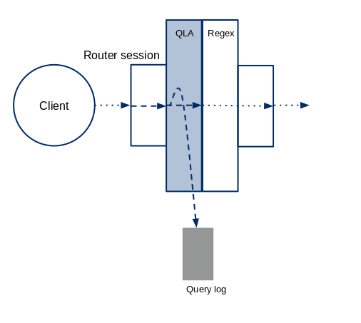

# MariaDB MaxScale Configuration & Usage Scenarios

## Introduction

This document describes how to configure MariaDB MaxScale and presents some
possible usage scenarios. MariaDB MaxScale is designed with flexibility in mind,
and consists of an event processing core with various support functions and
plugin modules that tailor the behavior of the program.

# Table of Contents

* [Glossary](#glossary)
* [Configuration](#configuration)
  * [Special Parameter Types](#special-parameter-types)
  * [Global Settings](#global-settings)
    * [REST API Configuration](#rest-api-configuration)
  * [Service](#service)
  * [Server](#server)
  * [Listener](#listener)
  * [TLS/SSL Encryption](#tlsssl-encryption)
* [Router Modules](#routing-modules)
* [Diagnostic Modules](#diagnostic-modules)
* [Monitor Modules](#monitor-modules)
* [Filter Modules](#filter-modules)
* [Encrypting Passwords](#encrypting-passwords)
* [Runtime Configuration Changes](#runtime-configuration-changes)
* [Authentication](#authentication)
* [Error Reporting](#error-reporting)

## Glossary

Word | Description
--------------------|----------------------------------------------------
service             | A service represents a set of databases with a specific access mechanism that is offered to clients of MariaDB MaxScale. The access mechanism defines the algorithm that MariaDB MaxScale will use to direct particular requests to the individual databases.
server              | A server represents an individual database server to which a client can be connected via MariaDB MaxScale.
router              | A router is a module within MariaDB MaxScale that will route client requests to the various database servers which MariaDB MaxScale provides a service interface to.
connection routing  | Connection routing is a method of handling requests in which MariaDB MaxScale will accept connections from a client and route data on that connection to a single database using a single connection. Connection based routing will not examine individual requests on a connection and it will not move that connection once it is established.
statement routing   | Statement routing is a method of handling requests in which each request within a connection will be handled individually. Requests may be sent to one or more servers and connections may be dynamically added or removed from the session.
protocol            | A protocol is a module of software that is used to communicate with another software entity within the system. MariaDB MaxScale supports the dynamic loading of protocol modules to allow for increased flexibility.
module              | A module is a separate code entity that may be loaded dynamically into MariaDB MaxScale to increase the available functionality. Modules are implemented as run-time loadable shared objects.
monitor             | A monitor is a module that can be executed within MariaDB MaxScale to monitor the state of a set of database. The use of an internal monitor is optional, monitoring may be performed externally to MariaDB MaxScale.
listener            | A listener is the network endpoint that is used to listen for connections to MariaDB MaxScale from the client applications. A listener is associated to a single service, however, a service may have many listeners.
connection failover | When a connection currently being used between MariaDB MaxScale and the database server fails a replacement will be automatically created to another server by MariaDB MaxScale without client intervention
backend database    | A term used to refer to a database that sits behind MariaDB MaxScale and is accessed by applications via MariaDB MaxScale.
filter              | A module that can be placed between the client and the MariaDB MaxScale router module. All client data passes through the filter module and may be examined or modified by the filter modules.  Filters may be chained together to form processing pipelines.
REST API | HTTP administrative interface

## Configuration

The MariaDB MaxScale configuration is read from a file that MariaDB MaxScale
will look for in the following places:

1. By default, the file `maxscale.cnf` in the directory `/etc`
2. The location given with the `--configdir=<path>` command line argument.

MariaDB MaxScale will further look for a directory with the same name as the
configuration file, followed by `.d` (for instance `/etc/maxscale.cnf.d`) and
recursively read all files, having a `.cnf` suffix, it finds in the directory
hierarchy. All other files will be ignored.

There are no restrictions on how different configuration sections are arranged,
but the strong suggestion is to place global settings into the configuration
file MariaDB MaxScale is invoked with, and then, if deemed necessary, create
separate configuration files for _servers_, _filters_, etc.

The configuration file itself is based on the
[.ini](https://en.wikipedia.org/wiki/INI_file) file format and consists of
various sections that are used to build the configuration; these sections define
services, servers, listeners, monitors and global settings. Parameters, which
expect a comma-separated list of values can be defined on multiple lines. The
following is an example of a multi-line definition.

```
[MyService]
type=service
router=readconnroute
servers=server1,
        server2,
        server3
```

The values of the parameter that are not on the first line need to have at least
one whitespace character before them in order for them to be recognized as a
part of the multi-line parameter.

Comments are defined by prefixing a row with a hash (`#`). Trailing comments are
not supported.

```
# This is a comment before a parameter
some_parameter=123
```

### Special Parameter Types

#### Sizes

Where _specifically noted_, a number denoting a size can be suffixed by a subset
of the IEC binary prefixes or the SI prefixes. In the former case the number
will be interpreted as a certain multiple of 1024 and in the latter case as a
certain multiple of 1000. The supported IEC binary suffixes are `Ki`, `Mi`, `Gi`
and `Ti` and the supported SI suffixes are `k`, `M`, `G` and `T`. In both cases,
the matching is case insensitive.

For instance, the following entries
```
max_size=1099511628000
max_size=1073741824Ki
max_size=1048576Mi
max_size=1024Gi
max_size=1Ti
```
are equivalent, as are the following
```
max_size=1000000000000
max_size=1000000000k
max_size=1000000M
max_size=1000G
max_size=1T
```
#### Regular Expressions

When a regular expression (regex) parameter is accepted, the pattern string
should be enclosed in slashes e.g. `match=/^select/` defines the pattern
`^select`. The slashes allow whitespace to be read from the ends of the regex
string contrary to a normal string parameter and are removed before compiling
the pattern. For backwards compatibility, the slashes are not yet mandatory.
Omitting them is, however, deprecated and will be rejected in the next release
of MaxScale. Currently, *QLAFilter* accepts parameters in regular expression
form.

### Global Settings

The global settings, in a section named `[MaxScale]`, allow various parameters
that affect MariaDB MaxScale as a whole to be tuned. This section must be
defined in the root configuration file which by default is `/etc/maxscale.cnf`.

#### `threads`

This parameter controls the number of worker threads that are handling the
events coming from the kernel. The default is 1 thread. It is recommended that
you start with one thread and increase the number if you require greater
performance. Increasing the amount of worker threads beyond the number of
processor cores does not improve the performance, rather is likely to degrade
it, and can consume resources needlessly.

You can enable automatic configuration of this value by setting the value to
`auto`. This way MariaDB MaxScale will detect the number of available processors
and set the amount of threads to be equal to that number. This should only be
used for systems dedicated for running MariaDB MaxScale.

```
# Valid options are:
#       threads=[<number of threads> | auto ]

[MaxScale]
threads=1
```

Additional threads will be created to execute other internal services within
MariaDB MaxScale. This setting is used to configure the number of threads that
will be used to manage the user connections.

#### `thread_stack_size`

This parameter controls the stack size of the worker threads. The default value
is 0, which means that the pthread default will be used. The size can be specified
as explained in detail [here](#sizes).

```
thread_stack_size=5Mi
```

#### `auth_connect_timeout`

The connection timeout in seconds for the MySQL connections to the backend
server when user authentication data is fetched. Increasing the value of this
parameter will cause MariaDB MaxScale to wait longer for a response from the
backend server before aborting the authentication process. The default is 3
seconds.

```
auth_connect_timeout=10
```

#### `auth_read_timeout`

The read timeout in seconds for the MySQL connection to the backend database
when user authentication data is fetched. Increasing the value of this parameter
will cause MariaDB MaxScale to wait longer for a response from the backend
server when user data is being actively fetched. If the authentication is
failing and you either have a large number of database users and grants or the
connection to the backend servers is slow, it is a good idea to increase this
value. The default is 1 second.

```
auth_read_timeout=10
```

#### `auth_write_timeout`

The write timeout in seconds for the MySQL connection to the backend database
when user authentication data is fetched. Currently MariaDB MaxScale does not
write or modify the data in the backend server. The default is 2 seconds.

```
auth_write_timeout=10
```

#### `query_retries`

The number of times an interrupted internal query will be retried. This feature
was added in MaxScale 2.1.10 and is disabled by default.

An interrupted query is any query that is interrupted by a network
error. Connection timeouts are included in network errors and thus is it
advisable to make sure that the value of `query_retry_timeout` is set to an
adequate value. Internal queries are only used to retrieve authentication data
and monitor the servers.

#### `query_retry_timeout`

The total timeout in seconds for any retried queries. The default value is 5
seconds.

An interrupted query is retried for either the configured amount of attempts or
until the configured timeout is reached.

#### `passive`

Controls whether MaxScale is a passive node in a cluster of multiple MaxScale
instances. The default value is false.

This parameter is intended to be used with multiple MaxScale instances that use
failover functionality to manipulate the cluster in some form. Passive nodes
only observe the clusters being monitored and take no direct actions.

The following functionality is disabled when passive mode is enabled:

 * Automatic failover in the `mariadbmon` module
 * Automatic rejoin in the `mariadbmon` module
 * Launching of monitor scripts

**NOTE:** Even if MaxScale is in passive mode, it will still accept clients and
  route any traffic sent to it. The **only** operations affected by the passive
  mode are the ones listed above.

#### `ms_timestamp`

Enable or disable the high precision timestamps in logfiles. Enabling this adds
millisecond precision to all logfile timestamps.

```
# Valid options are:
#       ms_timestamp=<0|1>
ms_timestamp=1
```

#### `skip_permission_checks`

Skip service and monitor user permission checks. This is useful when you know
the permissions are OK and you want to speed up the startup process. This
parameter takes a boolean value and is disabled by default.

It is recommended to not disable the permission checks so that any missing
privileges are detected when maxscale is starting up. If you are experiencing a
slow startup of MaxScale due to large amounts of connection timeouts when
permissions are checked, disabling the permission checks could speed up the
startup process.

```
skip_permission_checks=true
```

#### `syslog`

Enable or disable the logging of messages to *syslog*.

By default logging to *syslog* is enabled.

```
# Valid options are:
#       syslog=<0|1>
syslog=1
```

To enable logging to syslog use the value 1 and to disable use the value 0.

#### `maxlog`

Enable to disable to logging of messages to MariaDB MaxScale's log file.

By default logging to *maxlog* is enabled.

```
# Valid options are:
#       syslog=<0|1>
maxlog=1
```

To enable logging to the MariaDB MaxScale log file use the value 1 and to
disable use the value 0.

#### `log_to_shm`

Enable or disable the writing of the *maxscale.log* file to shared memory. If
enabled, then the actual log file will be created under `/dev/shm` and a
symbolic link to that file will be created in the *MaxScale* log directory.

Logging to shared memory may be appropriate if *log_info* and/or *log_debug* are
enabled, as logging to a regular file may in that case cause performance
degradation, due to the amount of data logged. However, as shared memory is a
scarce resource, logging to shared memory should be used only temporarily and
not regularly.

Since *MariaDB MaxScale* can log to both file and *syslog* an approach that
provides maximum flexibility is to enable *syslog* and *log_to_shm*, and to
disable *maxlog*. That way messages will normally be logged to *syslog*, but if
there is something to investigate, *log_debug* and *maxlog* can be enabled from
*maxadmin*, in which case informational messages will be logged to the
*maxscale.log* file that resides in shared memory. But note that *log_debug*
messages will only be available if MaxScale has been built in debug mode.

By default, logging to shared memory is disabled.

```
# Valid options are:
#       log_to_shm=<0|1>
log_to_shm=1
```

To enable logging to shared memory use the value 1 and to disable use the value
0.

#### `log_warning`

Enable or disable the logging of messages whose syslog priority is *warning*.
Messages of this priority are enabled by default.

```
# Valid options are:
#       log_warning=<0|1>
log_warning=0
```

To disable these messages use the value 0 and to enable them use the value 1.

#### `log_notice`

Enable or disable the logging of messages whose syslog priority is *notice*.
Messages of this priority provide information about the functioning of MariaDB
MaxScale and are enabled by default.

```
# Valid options are:
#       log_notice=<0|1>
log_notice=0
```

To disable these messages use the value 0 and to enable them use the value 1.

#### `log_info`

Enable or disable the logging of messages whose syslog priority is *info*. These
messages provide detailed information about the internal workings of MariaDB
MaxScale and should not, due to their frequency, be enabled, unless there is a
specific reason for that. For instance, from these messages it will be evident,
e.g., why a particular query was routed to the master instead of to a slave.
These informational messages are disabled by default.

```
# Valid options are:
#       log_info=<0|1>
log_info=1
```

To disable these messages use the value 0 and to enable them use the value 1.

#### `log_debug`

Enable or disable the logging of messages whose syslog priority is *debug*. This
kind of messages are intended for development purposes and are disabled by
default. Note that if MariaDB MaxScale has been built in release mode, then
debug messages are excluded from the build and this setting will not have any
effect.

```
# Valid options are:
#       log_debug=<0|1>
log_debug=1
```

To disable these messages use the value 0 and to enable them use the value 1.

#### `log_messages`

**Deprecated** Use *log_notice* instead.

#### `log_trace`

**Deprecated** Use *log_info* instead.

#### `log_augmentation`

Enable or disable the augmentation of messages. If this is enabled, then each
logged message is appended with the name of the function where the message was
logged. This is primarily for development purposes and hence is disabled by
default.

```
# Valid options are:
#       log_augmentation=<0|1>
log_augmentation=1
```

To disable the augmentation use the value 0 and to enable it use the value 1.

#### `log_throttling`

It is possible that a particular error (or warning) is logged over and over
again, if the cause for the error persistently remains. To prevent the log from
flooding, it is possible to specify how many times a particular error may be
logged within a time period, before the logging of that error is suppressed for
a while.

```
# A valid value looks like
#       log_throttling = X, Y, Z
#
# where each value is a positive integer and X means the number of times a
# specific error may be logged within a time period of Y milliseconds, before
# the logging of that error is suppressed for Z milliseconds.
log_throttling=8, 2000, 15000
```

In the example above, the logging of a particular error will be suppressed for
15 seconds if the error has been logged 8 times in 2 seconds.

The default is `10, 1000, 10000`, which means that if the same error is logged
10 times in one second, the logging of that error is suppressed for the
following 10 seconds.

To disable log throttling, add an entry with an empty value

```
log_throttling=
```
or one where any of the integers is 0.

```
log_throttling=0, 0, 0
```

Note that *notice*, *info* and *debug* messages are never throttled.

#### `logdir`

Set the directory where the logfiles are stored. The folder needs to be both
readable and writable by the user running MariaDB MaxScale.

```
logdir=/tmp/
```

#### `datadir`

Set the directory where the data files used by MariaDB MaxScale are stored.
Modules can write to this directory and for example the binlogrouter uses this
folder as the default location for storing binary logs.

```
datadir=/home/user/maxscale_data/
```

#### `libdir`

Set the directory where MariaDB MaxScale looks for modules. The library
directory is the only directory that MariaDB MaxScale uses when it searches for
modules. If you have custom modules for MariaDB MaxScale, make sure you have
them in this folder.

```
libdir=/home/user/lib64/
```

#### `cachedir`

Configure the directory MariaDB MaxScale uses to store cached data. An example
of cached data is the authentication data fetched from the backend servers.
MariaDB MaxScale stores this in case a connection to the backend server is not
possible.

```
cachedir=/tmp/maxscale_cache/
```

#### `piddir`

Configure the directory for the PID file for MariaDB MaxScale. This file
contains the Process ID for the running MariaDB MaxScale process.

```
piddir=/tmp/maxscale_cache/
```

#### `execdir`

Configure the directory where the executable files reside. All internal
processes which are launched will use this directory to look for executable
files.

```
execdir=/usr/local/bin/
```

#### `connector_plugindir`

Location of the MariaDB Connector-C plugin directory. The MariaDB Connector-C
used in MaxScale can use this directory to load authentication plugins. The
versions of the plugins must be binary compatible with the connector version
that MaxScale was built with.

```
connector_plugindir=/usr/lib/plugin/
```

#### `persistdir`

Configure the directory where persisted configurations are stored. When a new
server is created via MaxAdmin, it will be stored in this directory. Do not use
or modify the contents of this directory, use _/etc/maxscale.cnf.d/_ instead.

```
persistdir=/var/lib/maxscale/maxscale.cnf.d/
```

#### `module_configdir`

Configure the directory where module configurations are stored. Path arguments
are resolved relative to this directory. This directory should be used to store
module specific configurations e.g. dbfwfilter rule files.

Any configuration parameter that is not an absolute path will be interpreted as
a relative path. The relative paths use the module configuration directory as
the working directory.

For example, the configuration parameter `file=my_file.txt` would be interpreted
as `/etc/maxscale.cnf.d/my_file.txt` whereas `file=/home/user/my_file.txt` would
be interpreted as `/home/user/my_file.txt`.

```
module_configdir=/var/lib/maxscale/
```

#### `language`

Set the folder where the errmsg.sys file is located in. MariaDB MaxScale will
look for the errmsg.sys file installed with MariaDB MaxScale from this folder.

```
language=/home/user/lang/
```

#### `query_classifier`

The module used by MariaDB MaxScale for query classification. The information
provided by this module is used by MariaDB MaxScale when deciding where a
particular statement should be sent. The default query classifier is
_qc_sqlite_.

#### `query_classifier_args`

Arguments for the query classifier. What arguments are accepted depends on the
particular query classifier being used. The default query classifier -
_qc_sqlite_ - supports the following arguments:

##### `log_unrecognized_statements`

An integer argument taking the following values:
   * 0: Nothing is logged. This is the default.
   * 1: Statements that cannot be parsed completely are logged. They may have been
partially parsed, or classified based on keyword matching.
   * 2: Statements that cannot even be partially parsed are logged. They may have
been classified based on keyword matching.
   * 3: Statements that cannot even be classified by keyword matching are logged.

```
query_classifier=qc_sqlite
query_classifier_args=log_unrecognized_statements=1
```

This will log all statements that cannot be parsed completely. This may be
useful if you suspect that MariaDB MaxScale routes statements to the wrong
server (e.g. to a slave instead of to a master).

#### `substitute_variables`

Enable or disable the substitution of environment variables in the MaxScale
configuration file. If the substitution of variables is enabled and a
configuration line like
```
some_parameter=$SOME_VALUE
```
is encountered, then `$SOME_VALUE` will be replaced with the actual value
of the environment variable `SOME_VALUE`. Note:
* Variable substitution will be made _only_ if '$' is the first character
  of the value.
* _Everything_ following '$' is interpreted as the name of the environment
  variable.
* Referring to a non-existing environment variable is a fatal error.

By default, the value of `substitute_variables` is `false`.
```
substitute_variables=true
```
The setting of `substitute_variables` will have an effect on all parameters
in the all other sections, irrespective of where the `[maxscale]` section
is placed in the configuration file. However, in the `[maxscale]` section,
to ensure that substitution will take place, place the
`substitute_variables=true` line first.

#### `sql_mode`

Specifies whether the query classifier parser should initially expect _MariaDB_
or _PL/SQL_ kind of SQL.

The allowed values are:
   `default`: The parser expects regular _MariaDB_ SQL.
   `oracle` : The parser expects PL/SQL.

```
sql_mode=oracle
```

The default value is `default`.

**NOTE** If `sql_mode` is set to `oracle`, then MaxScale will also assume
that `autocommit` initially is off.

At runtime, MariaDB MaxScale will recognize statements like
```
set sql_mode=oracle;
```
and
```
set sql_mode=default;
```
and change mode accordingly.

**NOTE** If `set sql_mode=oracle;` is encountered, then MaxScale will also
behave as if `autocommit` had been turned off and conversely, if
`set sql_mode=default;` is encountered, then MaxScale will also behave
as if `autocommit` had been turned on.

Note that MariaDB MaxScale is **not** explicitly aware of the sql mode of
the server, so the value of `sql_mode` should reflect the sql mode used
when the server is started.

#### `local_address`

What specific local address/interface to use when connecting to servers.

This can be used for ensuring that MaxScale uses a particular interface
when connecting to servers, in case the computer MaxScale is running on
has multiple interfaces.
```
local_address=192.168.1.254
```

#### `users_refresh_time`

How often, in seconds, MaxScale at most may refresh the users from the
backend server.

MaxScale will at startup load the users from the backend server, but if
the authentication of a user fails, MaxScale assumes it is because a new
user has been created and will thus refresh the users. By default, MaxScale
will do that at most once per 30 seconds and with this configuration option
that can be changed. The minimum allowed value is 10 seconds. A negative
value disables the refreshing entirelly. Note that using `maxadmin` it is
possible to explicitly cause the users of a service to be reloaded.
```
users_refresh_time=120
```

#### `retain_last_statements`

How many statements MaxScale should store for each session. This is for
debugging purposes, as in case of problems it is often of value to be able
to find out exactly what statements were sent before a particular
problem turned up.

**Note:** See also `dump_last_statements` using which the actual dumping
  of the statements is enabled. Unless both of the parameters are defined,
  the statement dumping mechanism doesn't work.

```
retain_last_statements=20
```

Default is `0`.

#### `dump_last_statements`

With this configuration item it is specified in what circumstances MaxScale
should dump the last statements that a client sent. The allowed values are
`never`, `on_error` and `on_close`. With `never` the statements are never
logged, with `on_error` they are logged if the client closes the connection
improperly, and with `on_close` they are always logged when a client session
is closed.
```
dump_last_statements=on_error
```
Default is `never`.

Note that you need to specify with `retain_last_statements` how many statements
MaxScale should retain for each session. Unless it has been set to another value
than `0`, this configuration setting will not have an effect.

### REST API Configuration

The MaxScale REST API is an HTTP interface that provides JSON format data
intended to be consumed by monitoring appllications and visualization tools.

The following options must be defined under the `[maxscale]` section in the
configuration file.

#### `admin_host`

The network interface where the REST API listens on. The default value is the
IPv4 address `127.0.0.1` which only listens for local connections.

#### `admin_port`

The port where the REST API listens on. The default value is port 8989.

#### `admin_auth`

Enable REST API authentication using HTTP Basic Access
authentication. This is not a secure method of authentication without HTTPS but
it does add a small layer of security. This option is enabled by default.

The admin interface authentication uses the same user as MaxAdmin network
interface. This means that new users can be added with both MaxAdmin and the
REST API. The default credentials for the interface are `admin:mariadb`.

#### `admin_ssl_key`

The path to the TLS private key in PEM format for the admin interface.

If the `admin_ssl_key`, `admin_ssl_cert` and `admin_ssl_ca_cert` options are all
defined, the admin interface will use encrypted HTTPS instead of plain HTTP.

#### `admin_ssl_cert`

The path to the TLS public certificate in PEM format. See `admin_ssl_key`
documentation for more details.

#### `admin_ssl_ca_cert`

The path to the TLS CA certificate in PEM format. See `admin_ssl_key`
documentation for more details.

#### `admin_enabled`

Enable or disable the admin interface. This allows the admin interface to
be completely disabled to prevent access to it.

#### `admin_log_auth_failures`

Log authentication failures for the admin interface. This parameter expects a
boolean value and is enabled by default.

### Service

A service represents the database service that MariaDB MaxScale offers to the
clients. In general a service consists of a set of backend database servers and
a routing algorithm that determines how MariaDB MaxScale decides to send
statements or route connections to those backend servers.

A service may be considered as a virtual database server that MariaDB MaxScale
makes available to its clients.

Several different services may be defined using the same set of backend servers.
For example a connection based routing service might be used by clients that
already performed internal read/write splitting, whilst a different statement
based router may be used by clients that are not written with this functionality
in place. Both sets of applications could access the same data in the same
databases.

A service is identified by a service name, which is the name of the
configuration file section and a type parameter of service.

```
[Test Service]
type=service
```

In order for MariaDB MaxScale to forward any requests it must have at least one
service defined within the configuration file. The definition of a service alone
is not enough to allow MariaDB MaxScale to forward requests however, the service
is merely present to link together the other configuration elements.

#### `router`

The router parameter of a service defines the name of the router module that
will be used to implement the routing algorithm between the client of MariaDB
MaxScale and the backend databases. Additionally routers may also be passed a
comma separated list of options that are used to control the behavior of the
routing algorithm. The two parameters that control the routing choice are router
and router_options. The router options are specific to a particular router and
are used to modify the behavior of the router. The read connection router can be
passed options of master, slave or synced, an example of configuring a service
to use this router and limiting the choice of servers to those in slave state
would be as follows.

```
router=readconnroute
router_options=slave
```

To change the router to connect on to servers in the  master state as well as
slave servers, the router options can be modified to include the master state.

```
router=readconnroute
router_options=master,slave
```

A more complete description of router options and what is available for a given
router is included with the documentation of the router itself.

#### `router_options`

Option string given to the router module. The value of this parameter should be
a comma-separated list of key-value pairs. See router specific documentation for
more details.

#### `filters`

The filters option allow a set of filters to be defined for a service; requests
from the client are passed through these filters before being sent to the router
for dispatch to the backend server.  The filters parameter takes one or more
filter names, as defined within the filter definition section of the
configuration file. Multiple filters are separated using the | character.

```
filters=counter | QLA
```

The requests pass through the filters from left to right in the order defined in
the configuration parameter.

#### `servers`

The servers parameter in a service definition provides a comma separated list of
the backend servers that comprise the service. The server names are those used
in the name section of a block with a type parameter of server (see below).

```
servers=server1,server2,server3
```

#### `user`

The user parameter, along with the passwd parameter are used to define the
credentials used to connect to the backend servers to extract the list of
database users from the backend database that is used for the client
authentication.

```
user=maxscale
passwd=Mhu87p2D
```

Authentication of incoming connections is performed by MariaDB MaxScale itself
rather than by the database server to which the client is connected. The client
will authenticate itself with MariaDB MaxScale, using the username, hostname and
password information that MariaDB MaxScale has extracted from the backend
database servers. For a detailed discussion of how this impacts the
authentication process please see the "Authentication" section below.

The host matching criteria is restricted to IPv4, IPv6 will be added in a future
release.

Existing user configuration in the backend databases must be checked and may be
updated before successful MariaDB MaxScale authentication:

In order for MariaDB MaxScale to obtain all the data it must be given a username
it can use to connect to the database and retrieve that data. This is the
parameter that gives MariaDB MaxScale the username to use for this purpose.

The account used must be able to select from the mysql.user table, the following
is an example showing how to create this user.

```
CREATE USER 'maxscale'@'maxscalehost' IDENTIFIED BY 'maxscale-password';
```

Additionally, `SELECT` privileges on the `mysql.user`, `mysql.db` and `mysql.tables_priv`
tables and `SHOW DATABASES` privileges are required in order to load databases
name and grants suitable for database name authorization.

```
GRANT SELECT ON mysql.user TO 'maxscale'@'maxscalehost';
GRANT SELECT ON mysql.db TO 'maxscale'@'maxscalehost';
GRANT SELECT ON mysql.tables_priv TO 'maxscale'@'maxscalehost';
GRANT SELECT ON mysql.roles_mapping TO 'maxscale'@'maxscalehost';
GRANT SHOW DATABASES ON *.* TO 'maxscale'@'maxscalehost';
```

See [MaxScale Troubleshooting](https://mariadb.com/kb/en/mariadb-enterprise/maxscale-troubleshooting/)
for more information on how to troubleshoot authentication related problems.

**Note:** Due to a bug in MariaDB 10.2.9, if you see a
          `SELECT command denied to user ... for table 'users'`
          error, grant `SELECT ON mysql.*` to this user.

<a id="passwd"></a>
#### `password`

The password parameter provides the password information for the above user and
may be either a plain text password or it may be an encrypted password.  See the
section on encrypting passwords for use in the maxscale.cnf file. This user must
be capable of connecting to the backend database and executing these SQL
statements to load database names and grants from the backends:

* `SELECT user, host, password,Select_priv FROM mysql.user`.
* `SELECT user, host, db FROM mysql.db`
* `SELECT * FROM INFORMATION_SCHEMA.SCHEMATA`
* `SELECT GRANTEE,PRIVILEGE_TYPE FROM INFORMATION_SCHEMA.USER_PRIVILEGES`

#### `enable_root_user`

This parameter controls the ability of the root user to connect to MariaDB
MaxScale and hence onwards to the backend servers via MariaDB MaxScale.

The default value is `0`, disabling the ability of the root user to connect to
MariaDB MaxScale.

Example for enabling root user:

```
enable_root_user=1
```

Values of `on` or `true` may also be given to enable the root user and `off` or
`false` may be given to disable the use of the root user.

```
enable_root_user=true
```

#### `localhost_match_wildcard_host`

This parameter enables matching of "127.0.0.1" (localhost) against "%" wildcard
host for MySQL protocol authentication. The default value is `0`, so in order to
authenticate a connection from the same machine as the one on which MariaDB
MaxScale is running, an explicit user@localhost entry will be required in the
MySQL user table.

#### `version_string`

This parameter sets a custom version string that is sent in the MySQL Handshake
from MariaDB MaxScale to clients.

Example:

```
version_string=5.5.37-MariaDB-RWsplit
```

If not set, the default value is `5.5.5-10.0.0 MaxScale <MaxScale version>`
where `<MaxScale version>` is the version of MaxScale. If the provided string
does not start with the number 5, a 5.5.5- prefix will be added to it. This
means that a _version_string_ value of _MaxScale-Service_ would result in a
_5.5.5-MaxScale-Service_ being sent to the client.

#### `weightby`

The weightby parameter is used in conjunction with server parameters in order to
control the load balancing applied in the router in use by the service. This
allows varying weights to be applied to each server to create a non-uniform
distribution of the load amongst the servers.

An example of this might be to define a parameter for each server that
represents the amount of resource available on the server, we could call this
serversize. Every server should then have a serversize parameter set for the
server.

```
serversize=10
```

The service would then have the parameter `weightby=serversize`. If there are 4
servers defined in the service (serverA, serverB, serverC and serverD) with the
serversize set as shown in the table below, the connections would balanced using
the percentages in this table.

 Server  |serversize|% connections
---------|----------|-------------
serverA  |   10     |     18%
serverB  |   15     |     27%
serverC  |   10     |     18%
serverD  |   20     |     36%

_**Note**: If the value of the weighting parameter of an individual server is
zero or the relative weight rounds down to zero, no queries will be routed to
that server as long as a server with a positive weight is available._

Here is an excerpt from an example configuration with the `serv_weight`
parameter used as the weighting parameter.

```
[server1]
type=server
address=127.0.0.1
port=3000
protocol=MariaDBBackend
serv_weight=3

[server2]
type=server
address=127.0.0.1
port=3001
protocol=MariaDBBackend
serv_weight=1

[Read Service]
type=service
router=readconnroute
servers=server1,server2
weightby=serv_weight
```

With this configuration and a heavy query load, the server _server1_ will get
most of the connections and about a third of the remaining queries are routed to
the second server. With server weights, you can assign secondary servers that
are only used when the primary server is under heavy load.

Without the weightby parameter, each connection counts as a single connection.
With a weighting parameter, a single connection received its weight from the
server's own weighting parameter divided by the sum of all weighting parameters
in all the configured servers.

If we use the previous configuration as an example, the sum of the `serv_weight`
parameter is 4. _Server1_ would receive a weight of `3/4=75%` and _server2_
would get `1/4=25%`. This means that _server1_ would get 75% of the connections
and _server2_ would get 25% of the connections.

#### `auth_all_servers`

This parameter controls whether only a single server or all of the servers are
used when loading the users from the backend servers. This takes a boolean value
and when enabled, creates a union of all the users and grants on all the
servers.

#### `strip_db_esc`

The strip_db_esc parameter strips escape characters from database names of
grants when loading the users from the backend server.

This parameter takes a boolean value and when enabled, will strip all backslash (`\`)
characters from the database names. The default value for this parameter is true
since MaxScale 2.0.1. In previous version, the default value was false.

Some visual database management tools automatically escape some characters and
this might cause conflicts when MariaDB MaxScale tries to authenticate users.

#### `retry_on_failure`

The retry_on_failure parameter controls whether MariaDB MaxScale will try to
restart failed services and accepts a boolean value. This functionality is
enabled by default to prevent services being permanently disabled if the
starting of the service failed due to a network outage. Disabling the restarting
of the failed services will cause them to be permanently disabled if the
services can't be started when MariaDB MaxScale is started.

#### `log_auth_warnings`

Enable or disable the logging of authentication failures and warnings. This
parameter takes a boolean value.

MariaDB MaxScale normally suppresses warning messages about failed
authentication. Enabling this option will log those messages into the message
log with details about who tried to connect to MariaDB MaxScale and from where.

#### `connection_timeout`

The connection_timeout parameter is used to disconnect sessions to MariaDB
MaxScale that have been idle for too long. The session timeouts are disabled by
default. To enable them, define the timeout in seconds in the service's
configuration section. A value of zero is interpreted as no timeout, the same
as if the parameter is not defined.

Example:

```
[Test Service]
connection_timeout=300
```

#### `max_connections`

The maximum number of simultaneous connections MaxScale should permit to this
service. If the parameter is zero or is omitted, there is no limit. Any attempt
to make more connections after the limit is reached will result in a "Too many
connections" error being returned.

Example:

```
[Test Service]
max_connections=100
```

#### `max_retry_interval`

Configure the maximum interval between consecutive attempts to bind to an
interface. The default value for this parameter is 3600 seconds. This
parameter was introduced in MaxScale 2.2.0.

When a listener fails to bind to the interface it is assigned to, it will
attempt to bind to the interface again after 10 seconds. If the attempt fails,
the interval is incremented by 10 seconds and the next attempt will be in 20
seconds. The interval is incremented until the value of `max_retry_interval` is
reached at which point the listener attempts to bind to the interface every
`max_retry_interval` seconds.

### Server

Server sections are used to define the backend database servers that can be
formed into a service. A server may be a member of one or more services within
MariaDB MaxScale. Servers are identified by a server name which is the section
name in the configuration file. Servers have a type parameter of server, plus
address port and protocol parameters.

```
[server1]
type=server
address=127.0.0.1
port=3000
protocol=MariaDBBackend
```

#### `address`

The IP address or hostname of the machine running the database server that is
being defined. MariaDB MaxScale will use this address to connect to the backend
database server.

#### `port`

The port on which the database listens for incoming connections. MariaDB
MaxScale will use this port to connect to the database server.

#### `protocol`

The name for the protocol module to use to connect MariaDB MaxScale to the
database. Currently only one backend protocol is supported, the MariaDBBackend
module.

#### `monitoruser`

The monitor has a username and password that is used to connect to all servers
for monitoring purposes, this may be overridden by supplying a monitoruser
statement for each individual server.

```
monitoruser=mymonitoruser
```

#### `monitorpw`

The monitor has a username and password that is used to connect to all servers
for monitoring purposes, this may be overridden by supplying a monpasswd
statement for the individual servers.

```
monitorpw=mymonitorpasswd
```

The monpasswd parameter may be either a plain text password or it may be an
encrypted password.  See the section on encrypting passwords for use in the
maxscale.cnf file.

#### `persistpoolmax`

The `persistpoolmax` parameter defaults to zero but can be set to an integer
value for a back end server. If it is non zero, then when a DCB connected to a
back end server is discarded by the system, it will be held in a pool for reuse,
remaining connected to the back end server. If the number of DCBs in the pool
has reached the value given by `persistpoolmax` then any further DCB that is
discarded will not be retained, but disconnected and discarded.

#### `persistmaxtime`

The `persistmaxtime` parameter defaults to zero but can be set to an integer
value indicating a number of seconds. A DCB placed in the persistent pool for a
server will only be reused if the elapsed time since it joined the pool is less
than the given value. Otherwise, the DCB will be discarded and the connection
closed.

For more information about persistent connections, please read the
[Administration Tutorial](../Tutorials/Administration-Tutorial.md).

#### `proxy_protocol`

If `proxy_protocol` is set to `on`, MaxScale will send a
[PROXY protocol](http://www.haproxy.org/download/1.8/doc/proxy-protocol.txt)
header when connecting client sessions to the server. The header contains the
original client IP address and port, as seen by MaxScale. The server will then
read the header and perform authentication as if the connection originated from
this address instead of MaxScale's IP address. With this feature, the user
accounts on the backend server can be simplified to only contain the actual
client hosts and not the MaxScale host.

PROXY protocol will be supported by MariaDB 10.3, which this feature has been
tested with. To use it, enable the PROXY protocol in MaxScale for every
compatible server and configure the MariaDB servers themselves to accept the
protocol headers from MaxScale's IP address. On the server side, the protocol
should be enabled  only for trusted IPs, as it allows the sender to spoof the
connection origin. If a proxy header is sent to a server not expecting it, the
connection will fail. Usually PROXY protocol should be enabled for every
server in a cluster, as they typically have similar grants.

Other SQL-servers may support PROXY protocol as well, but the implementation may
be highly restricting. Strict adherence to the protocol requires that the
backend server does not allow mixing of un-proxied and proxied connections from
a given IP. MaxScale requires normal connections to backends for monitoring and
authentication data queries, which would be blocked. To bypass this restriction,
the server monitor needs to be disabled and the service listener needs to be
configured to disregard authentication errors (`skip_authentication=true`).
Server states also need to be set manually in MaxAdmin. These steps are *not*
required for MariaDB 10.3, since its implementation is more flexible and allows
both PROXY-headered and headerless connections from a proxy-enabled IP.

#### `authenticator`

The authenticator module to use. Each protocol module defines a default
authentication module which is used if no `authenticator` parameter is found
from the configuration.

#### `authenticator_options`

Option string given to the authenticator module. The value of this parameter
should be a comma-separated list of key-value pairs. See authenticator specific
documentation for more details.

### Listener

The listener defines a port and protocol pair that is used to listen for
connections to a service. A service may have multiple listeners associated with
it, either to support multiple protocols or multiple ports. As with other
elements of the configuration the section name is the listener name and it can
be selected freely. A type parameter is used to identify the section as a
listener definition. Address is optional and it allows the user to limit
connections to certain interface only. Socket is also optional and used for Unix
socket connections.

The network socket where the listener listens will have a backlog of
connections. The size of this backlog is controlled by the
net.ipv4.tcp_max_syn_backlog and net.core.somaxconn kernel parameters.

Increasing the size of the backlog by modifying the kernel parameters helps with
sudden connection spikes and rejected connections. For more information see
[listen(2)](http://man7.org/linux/man-pages/man2/listen.2.html).

```
[<Listener name>]
type=listener
service=<Service name>]
protocol=[MariaDBClient|HTTPD]
address=[IP|hostname]
port=<Listen port number>
```

#### `service`

The service to which the listener is associated. This is the name of a service
that is defined elsewhere in the configuration file.

#### `protocol`

The name of the protocol module that is used for the communication between the
client and MariaDB MaxScale itself.

#### `address`

The address option sets the address that will be used to bind the listening
socket. The address may be specified as an IP address in 'dot notation' or as a
hostname. If the address option is not included in the listener definition the
listener will bind to all network interfaces.

#### `port`

The port to use to listen for incoming connections to MariaDB MaxScale from the
clients. If the port is omitted from the configuration a default port for the
protocol will be used.

#### `socket`

The `socket` option may be included in a listener definition, this configures
the listener to use Unix domain sockets to listen for incoming connections. The
parameter value given is the name of the socket to use.

**Note:** If you want to use both network ports and UNIX domain sockets
  with a service, define two separate listeners that connect to the same
  service.

#### `authenticator`

The authenticator module to use. Each protocol module defines a default
authentication module which is used if no `authenticator` parameter is found
from the configuration.

#### `authenticator_options`

Option string given to the authenticator module. The value of this parameter
should be a comma-separated list of key-value pairs. See authenticator specific
documentation for more details.

#### Available Protocols

The protocols supported by MariaDB MaxScale are implemented as external modules
that are loaded dynamically into the MariaDB MaxScale core. They allow MariaDB
MaxScale to communicate in various protocols both on the client side and the
backend side. Each of the protocols can be either a client protocol or a backend
protocol. Client protocols are used for client-MariaDB MaxScale communication
and backend protocols are for MariaDB MaxScale-database communication.

##### `MariaDBClient`

This is the implementation of the MySQL protocol that is used by clients of
MariaDB MaxScale to connect to MariaDB MaxScale.

##### `MariaDBBackend`

The MariaDBBackend protocol module is the implementation of the protocol that
MariaDB MaxScale uses to connect to the backend MariaDB, MySQL and Percona
Server databases. This implementation is tailored for the MariaDB MaxScale to
MySQL Database traffic and is not a general purpose implementation of the MySQL
protocol.

##### `telnetd`

The telnetd protocol module is used for connections to MariaDB MaxScale itself
for the purposes of creating interactive user sessions with the MariaDB MaxScale
instance itself. Currently this is used in conjunction with a special router
implementation, the debugcli.

##### `maxscaled`

The protocol used used by the maxadmin client application in order to connect to
MariaDB MaxScale and access the command line interface.

##### `HTTPD`

This protocol module is currently still under development, it provides a means
to create HTTP connections to MariaDB MaxScale for use by web browsers or
RESTful API clients.

### TLS/SSL encryption

This section describes configuration parameters for both servers and listeners
that control the TLS/SSL encryption method and the various certificate files
involved in it.

To enable TLS/SSL for a listener, you must set the `ssl` parameter to `required`
and provide the three files for `ssl_cert`, `ssl_key` and `ssl_ca_cert`.

To enable TLS/SSL for a server, you must set the `ssl` parameter to `required`
and provide at least the `ssl_ca_cert` parameter. If the backend database server
has certificate verification enabled, the `ssl_cert` and `ssl_key` parameters
must also be defined.

After this, MaxScale connections between the server and/or the client will be
encrypted. Note that the database must also be configured to use TLS/SSL
connections if backend connection encryption is used.

**Note:** MaxScale does not allow mixed use of TLS/SSL and normal connections on
  the same port.

If TLS encryption is enabled for a listener, any unencrypted connections to it
will be rejected. MaxScale does this to improve security by preventing
accidental creation of unencrypted connections.

The separation of secure and insecure connections differs from the MariaDB
server which allows both secure and insecure connections on the same port. As
MaxScale is the gateway through which all connections go, in order to guarantee
a more secure system MaxScale enforces a stricter security policy than what the
server does.

#### `ssl`

This enables SSL connections when set to `required`. If enabled, the certificate
files mentioned above must also be supplied. MaxScale connections to will then
be encrypted with TLS/SSL.

#### `ssl_key`

A string giving a file path that identifies an existing readable file. The file
must be the SSL private key MaxScale should use.

#### `ssl_cert`

A string giving a file path that identifies an existing readable file. The file
must be the SSL public certificate MaxScale should use. The certificate must
match the key defined in `ssl_key`.

#### `ssl_ca_cert`

A string giving a file path that identifies an existing readable file. The file
must be the Certificate Authority (CA) certificate that will be used to validate
any public certificates. This is a required parameter for SSL enabled
configurations. The CA certificate can consist of a certificate chain.

#### `ssl_version`

**Note:** It is highly recommended to leave this parameter to the default value
  of _MAX_. This will guarantee that the strongest available encryption is used.
  **Do not change this unless you know what you are doing**.

This parameter controls the level of encryption used. Accepted values are:

 * TLSv10
 * TLSv11
 * TLSv12
 * MAX

The default is to use the highest level of encryption available. For OpenSSL 1.0
and newer this is TLSv1.2.

#### `ssl_cert_verify_depth`

The maximum length of the certificate authority chain that will be accepted. The
default value is 9, same as the OpenSSL default. The configured value must be
larger than 0.

#### `ssl_verify_peer_certificate`

Peer certificate verification. This functionality is enabled by default.

When this feature is enabled, the certificate sent by the peer is verified
against the configured Certificate Authority. If you are using self-signed
certificates, set `ssl_verify_peer_certificate=false`.

#### Example SSL enabled server configuration

```
[server1]
type=server
address=10.131.24.62
port=3306
protocol=MariaDBBackend
ssl=required
ssl_cert=/usr/local/mariadb/maxscale/ssl/crt.max-client.pem
ssl_key=/usr/local/mariadb/maxscale/ssl/key.max-client.pem
ssl_ca_cert=/usr/local/mariadb/maxscale/ssl/crt.ca.maxscale.pem
```

This example configuration requires all connections to this server to be
encrypted with SSL. The paths to the certificate files and the Certificate
Authority file are also provided.

#### Example SSL enabled listener configuration

```
[RW-Split-Listener]
type=listener
service=RW-Split-Router
protocol=MariaDBClient
port=3306
ssl=required
ssl_cert=/usr/local/mariadb/maxscale/ssl/crt.maxscale.pem
ssl_key=/usr/local/mariadb/maxscale/ssl/key.csr.maxscale.pem
ssl_ca_cert=/usr/local/mariadb/maxscale/ssl/crt.ca.maxscale.pem
```

This example configuration requires all connections to be encrypted with
SSL. The paths to the certificate files and the Certificate Authority file are
also provided.

## Routing Modules

The main task of MariaDB MaxScale is to accept database connections from client
applications and route the connections or the statements sent over those
connections to the various services supported by MariaDB MaxScale.

Currently a number of routing modules are available, these are designed for a
range of different needs.

Connection based load balancing:
* [ReadConnRoute](../Routers/ReadConnRoute.md)

Read/Write aware statement based router:
* [ReadWriteSplit](../Routers/ReadWriteSplit.md)

Simple sharding on database level:
* [SchemaRouter](../Routers/SchemaRouter.md)

Binary log server:
* [Binlogrouter](../Routers/Binlogrouter.md)

## Diagnostic modules

These modules are used for diagnostic purposes and can tell about the status of
MariaDB MaxScale and the cluster it is monitoring.

* [MaxAdmin Module](../Routers/CLI.md)
* [Telnet Module](../Routers/Debug-CLI.md)

## Monitor Modules

Monitor modules are used by MariaDB MaxScale to internally monitor the state of
the backend databases in order to set the server flags for each of those
servers. The router modules then use these flags to determine if the particular
server is a suitable destination for routing connections for particular query
classifications. The monitors are run within separate threads of MariaDB
MaxScale and do not affect MariaDB MaxScale's routing performance.

The use of monitors is highly recommended but it is also possible to run MariaDB
MaxScale without a monitor module. In this case an external monitoring system
which sets the status of each server via MaxAdmin is needed.

* [MariaDB Monitor](../Monitors/MariaDB-Monitor.md)
* [Galera Monitor](../Monitors/Galera-Monitor.md)
* [NDBCluster Monitor](../Monitors/NDB-Cluster-Monitor.md)
* [Multi-Master Monitor](../Monitors/MM-Monitor.md)

## Filter Modules



Filters provide a means to manipulate or process requests as they pass through
MariaDB MaxScale between the client side protocol and the query router. A full
explanation of each filter's functionality can be found in its documentation.

The [Filter Tutorial](../Tutorials/Filter-Tutorial.md) document shows how you
can add a filter to a service and combine multiple filters in one service.

* [Query Log All (QLA) Filter](../Filters/Query-Log-All-Filter.md)
* [Regular Expression Filter](../Filters/Regex-Filter.md)
* [Tee Filter](../Filters/Tee-Filter.md)
* [Top Filter](../Filters/Top-N-Filter.md)
* [Database Firewall Filter](../Filters/Database-Firewall-Filter.md)
* [Query Redirection Filter](../Filters/Named-Server-Filter.md)
* [RabbitMQ Filter](../Filters/RabbitMQ-Filter.md)


## Encrypting Passwords

Passwords stored in the maxscale.cnf file may optionally be encrypted for added security.
This is done by creation of an encryption key on installation of MariaDB MaxScale.
Encryption keys may be created manually by executing the maxkeys utility with the argument
of the filename to store the key. The default location MariaDB MaxScale stores
the keys is `/var/lib/maxscale`. The passwords are encrypted using 256-bit AES CBC encryption.

```
 # Usage: maxkeys [PATH]
maxkeys /var/lib/maxscale/
```

Changing the encryption key for MariaDB MaxScale will invalidate any currently
encrypted keys stored in the maxscale.cnf file.

## Creating Encrypted Passwords

Encrypted passwords are created by executing the maxpasswd command with the location
of the .secrets file and the password you require to encrypt as an argument.

```
# Usage: maxpasswd PATH PASSWORD
maxpasswd /var/lib/maxscale/ MaxScalePw001
61DD955512C39A4A8BC4BB1E5F116705
```

The output of the maxpasswd command is a hexadecimal string, this should be inserted
into the maxscale.cnf file in place of the ordinary, plain text, password.
MariaDB MaxScale will determine this as an encrypted password and automatically decrypt
it before sending it the database server.

```
[Split Service]
type=service
router=readwritesplit
servers=server1,server2,server3,server4
user=maxscale
password=61DD955512C39A4A8BC4BB1E5F116705
```


## Runtime Configuration Changes

Read the following documents for different methods of altering the MaxScale
configuration at runtime.

* MaxAdmin
  * [Runtime Configuration Changes](../Reference/MaxAdmin.md#runtime-configuration-changes)

* MaxCtrl
  * [`create`](../Reference/MaxCtrl.md#create)
  * [`destroy`](../Reference/MaxCtrl.md#destroy)
  * [`add`](../Reference/MaxCtrl.md#add)
  * [`remove`](../Reference/MaxCtrl.md#remove)
  * [`alter`](../Reference/MaxCtrl.md#alter)

* [REST API](../REST-API/API.md) documentation

All changes to the configuration are persisted as individual configuration files
in `/var/lib/maxscale/maxscale.cnf.d/`. These files are applied after the main
configuration file and all auxiliary configurations have been loaded. This means
that once runtime configurations have been made, they need to be incorporated
into the main configuration files.

### Backing Up Configuration Changes

The combination of configuration files can be done either manually
(e.g. `rsync`) or with the `maxscale --export-config=FILE` command line
option. See `maxscale --help` for more information about how to use the
`--export-config` flag.

For example, to export the current runtime configuration, run the following
command.

```
maxscale --export-config=/tmp/maxscale.cnf.combined
```

This will create the `/tmp/maxscale.cnf.combined` file and write the current
configuration into the it. This allows new MaxScale instances to be easily set
up without requiring copying of all runtime configuration files.

## Reloading Configuration

**Note:** This functionality has been deprecated and should not be used.

---

The current MariaDB MaxScale configuration may be updated by editing the
configuration file and then forcing MariaDB MaxScale to reread the configuration
file. To force MariaDB MaxScale to reread the configuration file, send a SIGHUP
signal to the MariaDB MaxScale process or execute `reload config` in the
`maxadmin` client.

The following list of service parameters can be updated at runtime.

* user
* passwd
* enable_root_user
* max_connections
* connection_timeout
* auth_all_servers
* optimize_wildcard
* strip_db_esc
* localhost_match_wildcard_host
* max_slave_connections
* max_slave_replication_lag

In addition to these parameters, the server specific user credentials, _monitoruser_
and _monitorpw_, can also be updated at runtime.

### Limitations

Services that are removed via the configuration update mechanism can not be
physically removed from MariaDB MaxScale until there are no longer any
connections using the service.

When the number of threads is decreased the threads will not actually be
terminated until such time as they complete the current operation of that
thread.

Monitors can not be completely removed from the running MariaDB MaxScale.

## Authentication

MariaDB uses username, passwords and the client host in order to authenticate a
user, so a typical user would be defined as user X at host Y and would be given
a password to connect. MariaDB MaxScale uses exactly the same rules as MariaDB
when users connect to the MariaDB MaxScale instance, i.e. it will check the
address from which the client is connecting and treat this in exactly the same
way that MariaDB would. MariaDB MaxScale will pull the authentication data from
one of the backend servers and use this to match the incoming connections, the
assumption being that all the backend servers for a particular service will
share the same set of user credentials.

It is important to understand, however, that when MariaDB MaxScale itself makes
connections to the backend servers the backend server will see all connections
as originating from the host that runs MariaDB MaxScale and not the original
host from which the client connected to MariaDB MaxScale. Therefore the backend
servers should be configured to allow connections from the MariaDB MaxScale host
for every user that can connect from any host. Since there is only a single
password within the database server for a given host, this limits the
configuration such that a given user name must have the same password for every
host from which they can connect.

To clarify, if a user *X* is defined as using password *pass1* from host *a* and
*pass2* from host *b* then there must be an entry in the `user` table for user
*X* from the MariaDB MaxScale host, say *pass1*.

This would result in rows in the user table as follows

Username|Password|Client Host
--------|--------|-----------
   X    |  pass1 | a
   X    |  pass2 | b
   X    |  pass1 | MaxScale


In this case the user *X* would be able to connect to MariaDB MaxScale from host
a giving the password of *pass1*. In addition MariaDB MaxScale would be able to
create connections for this user to the backend servers using the username *X*
and password *pass1*, since the MariaDB MaxScale host is also defined to have
password *pass1*. User *X* would not however be able to connect from host *b*
since they would need to provide the password *pass2* in order to connect to
MariaDB MaxScale, but then MariaDB MaxScale would not be able to connect to the
backends as it would also use the password *pass2* for these connections.

### Wildcard Hosts

Hostname mapping in MariaDB MaxScale works in exactly the same way as for MariaDB,
if the wildcard is used for the host then any host other than the localhost
(127.0.0.1) will match. It is important to consider that the localhost check
will be performed at the MariaDB MaxScale level and at the MariaDB server level.

If MariaDB MaxScale and the databases are on separate hosts there are two
important changes in behavior to consider:

1. Clients running on the same machine as the backend database now may access
the database using the wildcard entry. The localhost check between the client
and MariaDB MaxScale will allow the use of the wildcard, since the client is not
running on the MariaDB MaxScale host. Also the wildcard entry can be used on the
database host as MariaDB MaxScale is making that connection and it is not
running on the same host as the database.

2. Clients running on the same host as MariaDB MaxScale can not access the
database via MariaDB MaxScale using the wildcard entry since the connection to
MariaDB MaxScale will be from the localhost. These clients are able to access
the database directly, as they will use the wildcard entry.

If MariaDB MaxScale is running on the same host as one or more of the database
nodes to which it is routing statements then the wildcard host entries can be
used to connect to MariaDB MaxScale but not to connect onwards to the database
running on the same node.

In all these cases the issue may be solved by adding an explicit entry for the
localhost address that has the same password as the wildcard entry. This may be
done using a statement as below for each of the databases that are required:

```
MariaDB [mysql]> GRANT SELECT, INSERT, UPDATE, DELETE, CREATE, DROP ON employee.* 'user1'@'localhost' IDENTIFIED BY 'xxx';
Query OK, 0 rows affected (0.00 sec)
```

### Limitations

At the time of writing the authentication mechanism within MariaDB MaxScale does
not support IPV6 address matching in connections rules. This is also in line
with the current protocol modules that do not support IPV6.

Wildcard address supported in the current version of MariaDB MaxScale are:

192.168.3.%
192.168.%.%
192.%.%.%

and short notations

192.%
192.%.%
192.168.%

Note that currently wildcards are only supported in conjunction with
IP-addresses, not with domain names.

## Error Reporting

MariaDB MaxScale is designed to be executed as a service, therefore all error
reports, including configuration errors, are written to the MariaDB MaxScale
error log file. By default, MariaDB MaxScale will log to a file in
`/var/log/maxscale`, the only exception to this is if the log directory is not
writable, in which case a message is sent to the standard error descriptor.

### Troubleshooting

MariaDB MaxScale binds on TCP ports and UNIX sockets as well.

If there is a local firewall in the server where MariaDB MaxScale is installed,
the IP and port must be configured in order to receive connections from
outside.

If the firewall is a network facility among all the involved servers, a
configuration update is required as well.

Example:

```
[Galera Listener]
type=listener
address=192.168.3.33
port=4408
socket=/servers/maxscale/galera.sock
```

TCP/IP Traffic must be permitted to 192.168.3.33 port 4408

For Unix socket, the socket file path (example: `/servers/maxscale/galera.sock`)
must be writable by the Unix user MariaDB MaxScale runs as.
