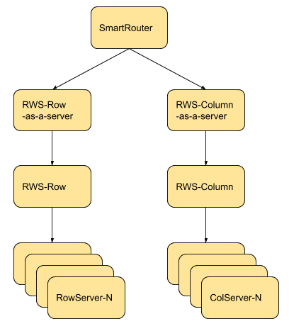

# SmartRouter

[TOC]

## Overview

SmartRouter is the query router of the SmartQuery framework. Based on the type
of the query, each query is routed to the server or cluster that can best
handle it.

For workloads where both transactional and analytical queries are needed,
SmartRouter unites the Transactional (OLTP) and Analytical (OLAP) workloads into
a single entry point in MaxScale. This allows a MaxScale client to freely mix
transactional and analytical queries using the same connection. This is known
as Hybrid Transactional and Analytical Processing, HTAP.

## Configuration

SmartRouter is configured as a service that either routes to other MaxScale
routers or plain servers. Although one can configure SmartRouter to use a plain
server directly, we refer to the configured "servers" as clusters.

For details about the standard service parameters, refer to the
[Configuration Guide](../Getting-Started/Configuration-Guide.md).

### `master`

One of the clusters must be designated as the **`master`**. All writes go to the
master cluster, which for all practical purposes should be a master-slave
ReadWriteSplit. This document does not go into details about setting up
master-slave clusters, but suffice to say, that when setting up the ColumnStore
servers they should be configured to be slaves of a MariaDB server running an
InnoDB engine. The ReadWriteSplit [documentation](ReadWriteSplit.md) has more on
master-slave setup.

### Service as a Server

Currently the configuration for a router (service) can have a number of servers,
but not other routers (services). Suppose you have a cluster of servers that are
managed by ReadWriteSplit. In order for that cluster to be routed-to by
SmartRouter, the service must be exposed as a server. A server section in the
configuration file that exposes a service instead of defining an actual server,
is known as *Service as a Server*.

#### Example



Suppose we have a service like
```
[RWS-Row]
type=service
router=readwritesplit
```
for which we have defined the listener
```
[RWS-Row-Listener]
type=listener
service=RWS-Row
socket=/tmp/rws-row.sock
```
That is, that service can be accessed using the socket `/tmp/rws-row.sock`.

A server section that would expose that service as a server, looks like this:
```
[RWS-Row-as-a-server]
type=server
socket=/tmp/rws-row.sock
```
Assuming we have defined `RWS-Column`, `RWS-Column-Listener` and
`RWS-Column-as-a-server` similarly, we can define the SmartQuery
service as follows:
```
[SmartQuery]
type = service
router = smartrouter
servers = RWS-Row-as-a-server, RWS-Column-as-a-server
master = RWS-Row-as-a-server
user = <user>
password = <password>

[SmartQuery-Listener]
type = listener
service = SmartQuery
protocol = mariadbclient
port = <port>
```
Note that the SmartQuery listener listens on a port, while the Service as a Server
listeners listen on a Unix domain socket. The reason is that there is a significant
performance benefit when SmartRouter accesses the services over a Unix domain socket
compared to accessing them over a TCP/IP socket.

Note that RWS-Row-as-a-server is designated as the master.

The RWS-Row-as-a-server looks like this:
```
[RWS-Row-Listener]
type = listener
service = RWS-Row
protocol = mariadbclient
socket = /tmp/rws-row.sock

[RWS-Row-as-a-server]
type     = server
socket = /tmp/rws-row.sock
protocol = MariaDBBackend
```
A complete configuration example can be found at the end of this document.

## Cluster selection - how queries are routed

SmartRouter keeps track of the performance, or the execution time, of queries to
the clusters. Measurements are stored with the canonical of a query as the key.
The canonical of a query is the sql with all user-defined constants replaced with
question marks. When SmartRouter sees a read-query whose canonical has not been
seen before, it will send the query to all clusters. The first response from a
cluster will designate that cluster as the best one for that canonical. Also,
when the first response is received, the other queries are cancelled. The
response is sent to the client once all clusters have responded to the query
or the cancel.

There is obviously overhead when a new canonical is seen. This means that
queries after a MaxScale start will be slightly slower than normal. The
execution time of a query depends on the database engine, and on the contents
of the tables being queried. As a result, MaxScale will periodically re-measure
queries.

The performance behavior of queries under dynamic conditions, and their effect
on different storage engines is being studied at MariaDB. As we learn more, we
will be able to better categorize queries and move that knowledge into
SmartRouter.

## Limitations

* `LOAD DATA LOCAL INFILE` is not supported.
* The performance data is not persisted. The measurements have to be performed
anew after each startup.

## Complete configuration example
```
[maxscale]

[row_server_1]
type = server
address = <ip>
port = <port>
protocol = MariaDBBackend

[row_server_2]
type = server
address = <ip>
port = <port>
protocol = MariaDBBackend

[Row-Monitor]
type = monitor
module = mariadbmon
servers = row_server_1, row_server_2
user = <user>
password = <password>
monitor_interval = 2000ms

[column_server_1]
type = server
address = <ip>
port = <port>
protocol = MariaDBBackend

[Column-Monitor]
type = monitor
module = csmon
servers = column_server_1
user = <user>
password = <password>
monitor_interval = 2000ms

# Row Read write split
[RWS-Row]
type = service
router = readwritesplit
servers = row_server_1, row_server_2
user = <user>
password = <password>

[RWS-Row-Listener]
type = listener
service = RWS-Row
protocol = mariadbclient
socket = /tmp/rws-row.sock

# Columnstore Read write split
[RWS-Column]
type = service
router = readwritesplit
servers = column_server_1
user = <user>
password = <password>

[RWS-Column-Listener]
type = listener
service = RWS-Column
protocol = mariadbclient
socket = /tmp/rws-col.sock

[RWS-Row-as-a-server]
type = server
socket = /tmp/rws-row.sock
protocol = MariaDBBackend

[RWS-Column-as-a-server]
type     = server
socket = /tmp/rws-col.sock
protocol = MariaDBBackend

# Smart Query router
[SmartQuery]
type = service
router = smartrouter
servers = RWS-Row-as-a-server, RWS-Column-as-a-server
master = RWS-Row-as-a-server
user = <user>
password = <password>

[SmartQuery-Listener]
type = listener
service = SmartQuery
protocol = mariadbclient
port = <port>
```
