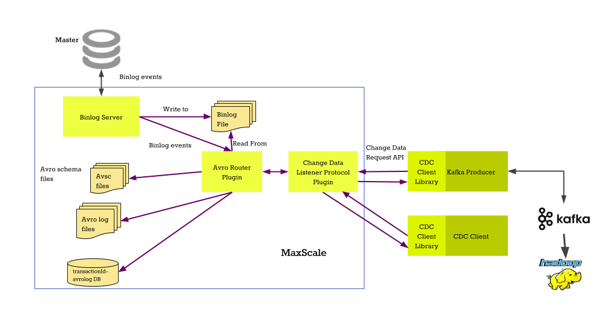

# Avrorouter Tutorial

This tutorial is a short introduction to the
[Avrorouter](../Routers/Avrorouter.md), how to set it up and how it interacts
with the binlogrouter.

The avrorouter can also be deployed directly on the master server which removes
the need to use the binlogrouter. This does require a lot more disk space on
the master server as both the binlogs and the Avro format files are stored there.

The first part configures the services and sets them up for the binary log to Avro
file conversion. The second part of this tutorial uses the client listener
interface for the avrorouter and shows how to communicate with the the service
over the network.



# Configuration

## Preparing the master server

The master server where we will be replicating from needs to have binary logging
enabled, the binary log format set to row based replication and the binary log
row image needs to contain all the changed. These can be enabled by adding the
two following lines to the _my.cnf_ file of the master.

```
binlog_format=row
binlog_row_image=full
```

_You can find out more about replication formats from the
[MariaDB Knowledge Base](https://mariadb.com/kb/en/mariadb/binary-log-formats/)_

## Configuring MaxScale

We start by adding two new services into the configuration file. The first
service is the binlogrouter service which will read the binary logs from the
master server. The second service will read the binlogs as they are streamed
from the master and convert them into Avro format files.

```
# The Replication Proxy service
[replication-service]
type=service
router=binlogrouter
router_options=server-id=4000,
               master-id=3000,
               binlogdir=/var/lib/maxscale/binlog/,
               mariadb10-compatibility=1,
user=maxuser
passwd=maxpwd

# The Avro conversion service
[avro-service]
type=service
router=avrorouter
source=replication-service
router_options=avrodir=/var/lib/maxscale/avro/,
               filestem=binlog

# The listener for the replication-service
[replication-listener]
type=listener
service=replication-router
protocol=MySQLClient
port=4000

# The client listener for the avro-service
[avro-listener]
type=listener
service=avro-service
protocol=CDC
port=4001
```

You can see that the `source` parameter in the _avro-service_ points to the
_replication-service_ we defined before.  This service will be the data source
for the avrorouter. The _filestem_ is the prefix in the binlog files and the
additional _avrodir_ router_option is where the converted Avro files are stored.
For more information on the avrorouter options, read the
[Avrorouter Documentation](../Routers/Avrorouter.md).

After the services were defined, we added the listeners for the
_replication-service_ and the _avro-service_. The _CDC_ protocol is a new
protocol added with the avrorouter and, at the time of writing, it is the only
supported protocol for the avrorouter.

# Preparing the data in the master server

Before starting the MaxScale process, we need to make sure that the binary logs
of the master server contain the DDL statements that define the table
layouts. What this means is that the `CREATE TABLE` statements need to be in the
binary logs before the conversion process is started.

If the binary logs contain data modification events for tables that aren't
created in the binary logs, the Avro schema of the table needs to be manually
created. There are two ways to do this:

- Manually create the schema
- Use the [_cdc_schema_ Go utilty](../Routers/Avrorouter.md#avro-schema-generator)

All Avro file schemas follow the same general idea. They are in JSON and follow
the following format:

```
{
    "namespace": "MaxScaleChangeDataSchema.avro",
    "type": "record",
    "name": "ChangeRecord",
    "fields":
    [
        {
            "name": "name",
            "type": "string"
        },
        {
            "name":"address",
            "type":"string"
        },
        {
            "name":"age",
            "type":"int"
        }
    ]
}
```

The avrorouter uses the schema file to identify the columns, their names and
what type they are. The _name_ field  contains the name of the column and the _type_
contains the Avro type. Read the [Avro specification](https://avro.apache.org/docs/1.8.1/spec.html)
for details on the layout of the schema files.

All Avro schema files for tables that are not created in the binary logs need to
be in the location pointed by the _avrodir_ router_option and must use the following naming: `<database>.<table>.<schema_version>.avsc`. For example, the schema file name of the _test.t1_ table would be `test.t1.0000001.avsc`.

# Starting MariaDB MaxScale

The next step is to start MariaDB MaxScale and set up the binlogrouter. We do
that by connecting to the MySQL listener of the _replication_router_ service and
executing a few commands.

```
CHANGE MASTER TO MASTER_HOST='172.18.0.1',
       MASTER_PORT=3000,
       MASTER_LOG_FILE='binlog.000001',
       MASTER_LOG_POS=4,
       MASTER_USER='maxuser',
       MASTER_PASSWORD='maxpwd';

START SLAVE;
```

This will start the replication of binary logs from the master server at
172.18.0.1:3000. For more details about the details of the commands, refer
to the [Binlogrouter](../Routers/Binlogrouter.md) documentation.

After the binary log streaming has started, the avrorouter will automatically
start converting the binlogs into Avro files.

For the purpose of this tutorial, create a simple test table using the following
statement and populated it with some data.

```
CREATE TABLE test.t1 (id INT);
INSERT INTO test.t1 VALUES (1), (2), (3), (4), (5), (6), (7), (8), (9), (10);
```

This table will be replicated through MaxScale and it will be converted into an
Avro file, which you can inspect by using the _maxavrocheck_ utility program.

```
[markusjm@localhost avrodata]$ ../bin/maxavrocheck test.t1.000001.avro
File sync marker: caaed7778bbe58e701eec1f96d7719a
/home/markusjm/build/avrodata/test.t1.000001.avro: 1 blocks, 1 records and 12 bytes
```
