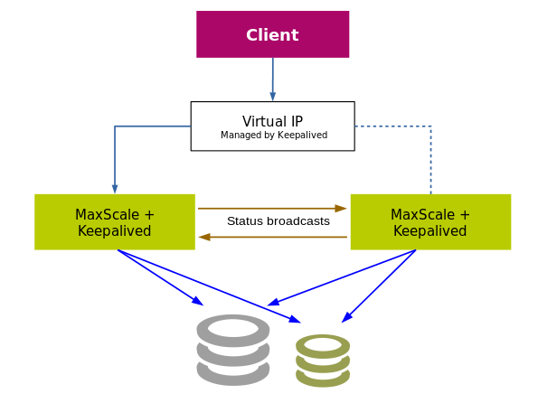

# MaxScale Failover with Keepalived and MaxCtrl

## Introduction

[Keepalived](http://www.keepalived.org/index.html) is a routing software for
load balancing and high-availability. It has several applications, but for this
tutorial the goal is to set up a simple IP failover between two servers running
MaxScale. If the main server fails the backup machine takes over, receiving any
new connections. The Keepalived settings used in this tutorial follow the
example given in [Simple keepalived failover setup on Ubuntu 14.04](
https://raymii.org/s/tutorials/Keepalived-Simple-IP-failover-on-Ubuntu.html).

Two hosts and one client machine are used, all in the same LAN. Hosts run
MaxScale and Keepalived. The backend servers may be running on one of the hosts,
e.g. in docker containers, or on separate machines for a more realistic setup.
Clients connect to the virtual IP (VIP), which is claimed by the current master
host.



Once configured and running, the different Keepalived nodes continuously
broadcast their status to the network and listen for each other. If a node does
not receive a status message from another node with a higher priority than
itself, it will claim the VIP, effectively becoming the master. Thus, a node can
be put online or removed by starting and stopping the Keepalived service.

If the current master node is removed (e.g. by stopping the service or pulling
the network cable) the remaining nodes will quickly elect a new master and
future traffic to the VIP will be directed to that node. Any connections to the
old master node will naturally break. If the old master comes back online, it
will again claim the VIP, breaking any connections to the backup machine.

MaxScale has no knowledge of this even happening. Both MaxScales are running
normally, monitoring the backend servers and listening for client connections.
Since clients are connecting through the VIP, only the machine claiming the VIP
will receive incoming connections. The connections between MaxScale and the
backends are using real IPs and are unaffected by the VIP.

## Configuration

MaxScale does not require any specific configuration to work with Keepalived in
this simple setup, it just needs to be running on both hosts. The MaxScale
configurations should be similar to the extent that both look identical to
connecting clients. In practice the listening ports and related services should
be the same. Setting the service-level setting “version_string” to different
values on the MaxScale nodes is recommended, as it will be printed to any
connecting clients indicating which node was connected to.

Keepalived requires specific setups on both machines. On the **primary host**,
the */etc/keepalived/keepalived.conf*-file should be as follows.

```
vrrp_instance VI_1 {
  state MASTER
  interface eth0
  virtual_router_id 51
  priority 150
  advert_int 1
  authentication {
    auth_type PASS
    auth_pass mypass
  }
  virtual_ipaddress {
    192.168.1.123
  }
}
```

The *state* must be MASTER on both hosts. *virtual_router_id* and *auth_pass*
must be identical on all hosts. The *interface* defines the network interface
used. This depends on the system, but often the correct value is *eth0*,
*enp0s12f3* or similar. *priority* defines the voting strength between different
Keepalived instances when negotiating on which should be the master. The
instances should have different values of priority. In this example, the backup
host(s) could have priority 149, 148 and so on. *advert_int* is the interval
between a host “advertising” its existence to other Keepalived host. One second
is a reasonable value.

*virtual_ipaddress* (VIP) is the IP the different Keepalived hosts try to claim
and must be identical between the hosts. For IP negotiation to work, the VIP
must be in the local network address space and unclaimed by any other machine
in the LAN. An example *keepalived.conf*-file for a **backup host** is listed
below.

```
vrrp_instance VI_1 {
  state MASTER
  interface eth0
  virtual_router_id 51
  priority 100
  advert_int 1
  authentication {
    auth_type PASS
    auth_pass mypass
  }
  virtual_ipaddress {
    192.168.1.123
  }
}
```

Once the Keepalived service is running, recent log entries can be printed with
the command `service keepalived status`.

```
Aug 11 10:27:59 maxscale2 Keepalived_vrrp[27369]: VRRP_Instance(VI_1) Received higher prio advert
Aug 11 10:27:59 maxscale2 Keepalived_vrrp[27369]: VRRP_Instance(VI_1) Entering BACKUP STATE
Aug 11 10:27:59 maxscale2 Keepalived_vrrp[27369]: VRRP_Instance(VI_1) removing protocol VIPs.
```

## MaxScale health check

So far, none of this tutorial has been MaxScale-specific and the health of the
MaxScale process has been ignored. To ensure that MaxScale is running on the
current master host, a *check script* should be set. Keepalived runs the script
regularly and if the script returns an error value, the Keepalived node will
assume that it has failed, stops broadcasting its state and relinquishes the
VIP. This allows another node to take the master status and claim the VIP. To
define a check script, modify the configuration as follows. The example is for
the primary node. See [Keepalived Check and Notify Scripts](
https://tobrunet.ch/2013/07/keepalived-check-and-notify-scripts/) for more
information.

```
vrrp_script chk_myscript {
  script "/home/scripts/is_maxscale_running.sh"
  interval 2 # check every 2 seconds
  fall 2 # require 2 failures for KO
  rise 2 # require 2 successes for OK
}

vrrp_instance VI_1 {
  state MASTER
  interface wlp2s0
  virtual_router_id 51
  priority 150
  advert_int 1
  authentication {
    auth_type PASS
    auth_pass mypass
  }
  virtual_ipaddress {
    192.168.1.13
  }
  track_script {
    chk_myscript
  }
}
```

An example script, *is_maxscale_running.sh*, is listed below. The script uses
MaxAdmin to try to contact the locally running MaxScale and request a server
list, then check that the list has at least some expected elements. The timeout
command ensures the MaxAdmin call exits in reasonable time. The script detects
if MaxScale has crashed, is stuck or is totally overburdened and no longer
responds to connections.

```
#!/bin/bash
fileName="maxadmin_output.txt"
rm $fileName
timeout 2s maxadmin list servers > $fileName
to_result=$?
if [ $to_result -ge 1 ]
then
  echo Timed out or error, timeout returned $to_result
  exit 3
else
  echo MaxAdmin success, rval is $to_result
  echo Checking maxadmin output sanity
  grep1=$(grep server1 $fileName)
  grep2=$(grep server2 $fileName)

  if [ "$grep1" ] && [ "$grep2" ]
  then
    echo All is fine
    exit 0
  else
    echo Something is wrong
    exit 3
  fi
fi
```

```
Aug 11 10:51:56 maxscale2 Keepalived_vrrp[20257]: VRRP_Script(chk_myscript) failed
Aug 11 10:51:57 maxscale2 Keepalived_vrrp[20257]: VRRP_Instance(VI_1) Entering FAULT STATE
Aug 11 10:51:57 maxscale2 Keepalived_vrrp[20257]: VRRP_Instance(VI_1) removing protocol VIPs.
Aug 11 10:51:57 maxscale2 Keepalived_vrrp[20257]: VRRP_Instance(VI_1) Now in FAULT state
```

## MaxScale active/passive-setting

When using multiple MaxScales with replication cluster management features
(failover, switchover, rejoin), only one MaxScale instance should be allowed to
modify the cluster at any given time. This instance should be the one with
MASTER Keepalived status. MaxScale itself does not know its state, but MaxCtrl
(a replacement for MaxAdmin) can set a MaxScale instance to passive mode. As of
version 2.2.2, a passive MaxScale behaves similar to an active one with the
distinction that it won't perform failover, switchover or rejoin. Even manual
versions of these commands will end in error. The passive/active mode
differences may be expanded in the future.

To have Keepalived modify the MaxScale operating mode, a notify script is
needed. This script is ran whenever Keepalived changes its state. The script
file is defined in the Keepalived configuration file as `notify`.

```
...
virtual_ipaddress {
  192.168.1.13
}
track_script {
  chk_myscript
}
notify /home/user/notify_script.sh
...
```
Keepalived calls the script with three parameters. In our case, only the third
parameter, STATE, is relevant. An example script is below.

```
#!/bin/bash

TYPE=$1
NAME=$2
STATE=$3

OUTFILE=/home/user/state.txt

case $STATE in
  "MASTER") echo "Setting this MaxScale node to active mode" > $OUTFILE
                  maxctrl alter maxscale passive false
                  exit 0
                  ;;
  "BACKUP") echo "Setting this MaxScale node to passive mode" > $OUTFILE
                  maxctrl alter maxscale passive true
                  exit 0
                  ;;
  "FAULT")  echo "MaxScale failed the status check." > $OUTFILE
                  maxctrl alter maxscale passive true
                  exit 0
                  ;;
        *)        echo "Unknown state" > $OUTFILE
                  exit 1
                  ;;
esac

```
The script logs the current state to a text file and sets the operating mode of
MaxScale. The FAULT case also attempts to set MaxScale to passive mode,
although the MaxCtrl command will likely fail.

If all MaxScale/Keepalived instances have a similar notify script, only one
MaxScale should ever be in active mode.
