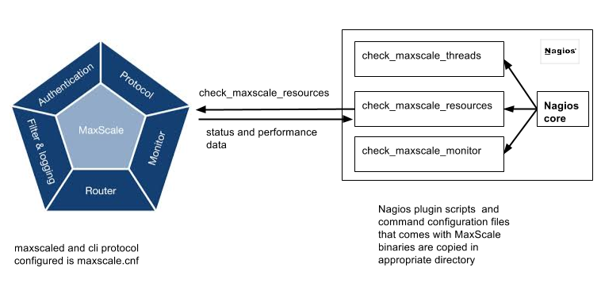

# MariaDB MaxScale Nagios plugins, for Nagios 3.5.1

# Introduction

Nagios® Core™ is an Open Source system and network monitoring application.
It watches hosts and services that you specify, alerting you when things go bad
and when they get better.
Nagios plugins are compiled executables or scripts (Perl scripts, shell scripts, etc.)
that can be run from a command line to check the status or a host or service.
Nagios uses the results from plugins to determine the current status of hosts and
services on your network.
Nagios core executes a plugin whenever there is a need to check the status
of a service or host.

While MariaDB MaxScale resources and status can be monitored via CLI using
maxadmin commands, Nagios Plugin provides an automated way for system administration
and database administrators to monitor MariaDB MaxScale.
The diagram below provides view of how Nagios and MariaDB MaxScale interact.



There are three Nagios plugin scripts that MariaDB MaxScale provides.

1. check_maxscale_threads.pl: This command provides you the status of current running
threads and events in the queue on MariaDB MaxScale Server.
The Performance data associated with this command current and historic wait time for threads and events

2. check_maxscale_resources.pl: This command provides you status of various resources
on MariaDB MaxScale server. The Performance data associated provides
details on respective resources.
Current resources are: modules, services, listeners, servers, sessions, filters.

3. check_maxscale_monitor.pl: This command provides you status of the configured
monitor modules on MariaDB MaxScale server.

In order to use these scripts on your Nagios Server, you need to copy them
from the MariaDB MaxScale binary package or download them from source tree on GitHub.

# MariaDB MaxScale Nagios Plugin Requirements

MariaDB MaxScale must be configured with 'maxscaled' protocol for the administration interface:

Example of maxscale.cnf file:

```
[AdminInterface]
type=service
router=cli

[AdminListener]
type=listener
service=AdminInterface
protocol=maxscaled
socket=default
```

## Prepare Nagios configuration files.

Assuming Nagios installed on a separated server and the plugins are
in /usr/lib64/nagios/plugins and configuration files are in /etc/nagios:

* Copy MariaDB MaxScale plugin scripts (./nagios/plugins/check_maxscale_*.pl)
to /usr/lib64/nagios/plugins on Nagios Server
* Copy New commands and server1 definition (./nagios/plugins/maxscale_commands.cfg, server1.cfg)
to /etc/nagios/objects/ on Nagios Server
* Edit /etc/nagios/nagios.cfg on Nagios Server

and add (just after localhost.cfg or commands.cfg)

```
cfg_file=/etc/nagios/objects/maxscale_commands.cfg
cfg_file=/etc/nagios/objects/server1.cfg
```

### Please note:
- modify server IP address in server1.cfg, pointing to MariaDB MaxScale server
- MariaDB MaxScale server must be reachable via ssh with identity file: i.e:

  `ssh -i /identity_files/maxscale_host.rsa user@mascale_host maxadmin ...`

- The default maxadmin executable path is /usr/bin/maxadmin can be changed by -m option
- default maxadmin socket (/tmp/maxadmin.sock) can be changed with -S option
- maxadmin executable is no longer required to be copied in Nagios server.
- the UNIX user in ssh connection should be also admin user for MariaDB MaxScale admin.
First time access or no configured users means the "root" user is the only one that can access
MariaDB MaxScale admin interface via UNIX socket.

Test maxadmin with proper user in maxscale server and later via SSH.
Those checks are strongly recommended before using Nagios scripts.

For additional information about Maxadmin and MariaDB MaxScale administrative interface
please refer to [MaxAdmin Utility](../Reference/MaxAdmin.md)

This example shows configuration that needs to be done on Nagios server in order to
communicate to MariaDB MaxScale server that is running on host server1.
In this example we are using the check_maxscale_resource as the check command

```
	#Check MariaDB MaxScale sessions, on the remote machine.
	define service{
		use			local-service
		host_name		server1
		service_description	MaxScale_sessions
		check_command		check_maxscale_resource!maxscale_user!user_identy_file!sessions!/tmp/maxadmin.sock!/path_to/maxadmin
		notifications_enabled	0
	}
```

### Check new running monitors
* Restart Nagios and check new monitors are running in HTTP Interface
"Current Status -> Services" on Nagios Server
* Look for any errors in /var/log/nagios/nagios.log or nagios.debug on Nagios Server

# Nagios Plugin command line usage

	(1) ./check_maxscale_threads.pl -h

	MaxScale monitor checker plugin for Nagios

	Usage: check_maxscale_threads.pl [-r <resource>] [-H <host>] [-u <user>] [-S <socket>] [-m <maxadmin>] [-h]

	Options:
       -r <resource>	= threads
       -h		= provide this usage message
       -H <host>	= which host to connect to with SSH
       -u <user>	= username to connect to maxscale host via SSH (same user is used for maxadmin authentication)
       -i <identity>	= identity file to use for <user> at <host>
       -m <maxadmin>	= /path/to/maxadmin
       -S <socket>      = UNIX socket path between maxadmin and maxscale (default
       is /tmp/maxadmin.sock)

	(2) ./check_maxscale_resources.pl -h

	MaxScale monitor checker plugin for Nagios

	Usage: check_maxscale_resources.pl [-r <resource>] [-H <host>] [-u <user>] [-S <socket>] [-m <maxadmin>] [-h]

	Options:
       -r <resource>	= modules|services|filters|listeners|servers|sessions
       -h		= provide this usage message
       -H <host>	= which host to connect to with SSH
       -u <user>	= username to connect to maxscale host via SSH (same user is used for maxadmin authentication)
       -i <identity>	= identity file to use for <user> at <host>
       -m <maxadmin>	= /path/to/maxadmin
       -S <socket>      = UNIX socket path between maxadmin and maxscale (default is /tmp/maxadmin.sock)

	(3) ./check_maxscale_monitor.pl -h

	MaxScale monitor checker plugin for Nagios

	Usage: check_maxscale_monitors.pl [-r <resource>] [-H <host>] [-u <user>] [-S <socket>] [-m <maxadmin>] [-h]

	Options:
       -r <resource>	= monitors
       -h		= provide this usage message
       -H <host>	= which host to connect to with SSH
       -u <user>	= username to connect to maxscale host via SSH (same user is used for maxadmin authentication)
       -i <identity>	= identity file to use for <user> at <host>
       -m <maxadmin>	= /path/to/maxadmin
       -S <socket>      = UNIX socket path between maxadmin and maxscale (default is /tmp/maxadmin.sock)

# Output description:

Example for 'services'

```
#./check_maxscale_resources.pl -r resources

OK: 7 services found | services1=RW_Router;readwritesplit;1;1 services2=RW_Split;
readwritesplit;1;1 services3=Test Service;readconnroute;1;1 services4=Master Service;
readconnroute;2;2 services5=Debug Service;debugcli;1;1 services6=CLI;cli;2;145
services7=MaxInfo;maxinfo;2;2
```

Returns OK and the number of services

Returns CRITICAL if no services are found

The data after | char are so called performance data and may be collected by Nagios
output format is:

```
servicex=Name;router_module;NumUsers;TotalSessions
```
