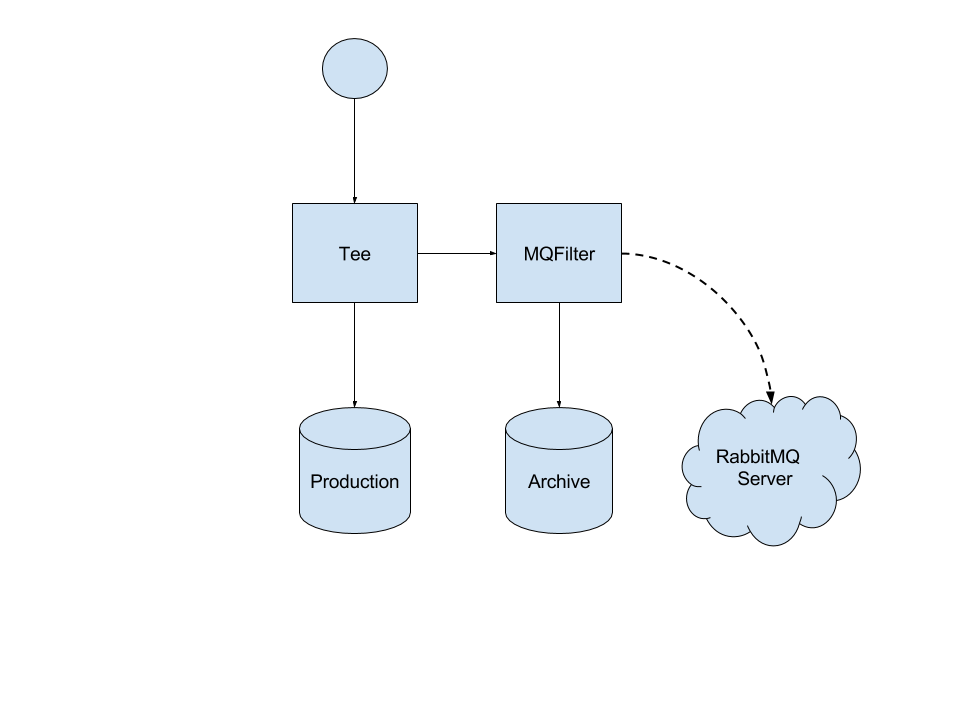

# Data archiving with Mqfilter and Tee filters

This tutorial gives a quick look into how you can combine various filters to create
systems for archiving data for analysis. The aim of this tutorial is to show
what can be done with MariaDB MaxScale's filters rather than demonstrate a proven method
of archiving data. For this tutorial you will need two MariaDB servers, one for
archiving the data and one for actual use, a RabbitMQ server and a MariaDB MaxScale server.
For testing purposes some of these can locate on the same server but for actual
use, an HA solution is recommended.



The use case for this tutorial is a production system with one main server where all
queries are routed and an archive server where only INSERT, UPDATE and DELETE statements
are routed. The queries routed to the archive servers are also transformed into a canonical
format and sent to a RabbitMQ broker for analysis. This setup allows us to control what we
send to the server and could possibly allow us to filter out DELETE statements completely,
making the archive server a true archive of all data.

## Setting up MariaDB MaxScale

The installation of MariaDB MaxScale is covered in the Installation chapter of the [MariaDB MaxScale Tutorial](MaxScale-Tutorial.md).

## Setting up the MariaDB servers

Since the archive server will not replicate from the main server, we don't need to
set up replication between the two. The only thing we need to do is to create the
users we will use for monitoring and authentication.

The process of creating monitoring and authentication users for MariaDB MaxScale is described
in the Creating Database Users section of the
[MariaDB MaxScale Tutorial](MaxScale-Tutorial.md#creating-database-users).

## Setting up RabbitMQ server

To set up the RabbitMQ server, follow the instructions for your OS on the [RabbitMQ website](https://www.rabbitmq.com/download.html).
Useful documentation about access rights can be found on the [Access Control](https://www.rabbitmq.com/access-control.html)
page and for UNIX systems the [`rabbitmqctl` manpage](https://www.rabbitmq.com/man/rabbitmqctl.1.man.html)
has all the needed commands to manage your installation of RabbitMQ.

For this tutorial, we will use a RabbitMQ server installed on a CentOS 7 from
the RPM packages. Since CentOS 7 doesn't have the RabbitMQ server in the default
repositories, we will need two extra repositories: The EPEL repository and the Erlang repository.

* [EPEL repositories](https://fedoraproject.org/wiki/EPEL)
* [Erlang repositories](https://www.erlang-solutions.com/resources/download.html)

First we need the EPEL and Erlang repositories for CentOS 7 after which we will install the RabbitMQ server:

```
sudo yum -y install https://dl.fedoraproject.org/pub/epel/epel-release-latest-7.noarch.rpm
sudo yum -y install http://packages.erlang-solutions.com/erlang-solutions-1.0-1.noarch.rpm
sudo yum -y install https://www.rabbitmq.com/releases/rabbitmq-server/v3.5.6/rabbitmq-server-3.5.6-1.noarch.rpm
```

Next step is to start the RabbitMQ server and configure it.

```
sudo systemctl start rabbitmq-server
```

We need to create the `msguser` account which we will use to relay the messages
to the broker. This can be done with the `rabbitmqctl` command.

```
sudo rabbitmqctl add_user "msguser" "msgpwd"
sudo rabbitmqctl set_permissions "msguser" ".*" ".*" ".*"
```

This creates the `msguser` account with `msgpwd` as the password and grants read, write and configurations
permissions on the default virtual host `/`.

## Configuration file creation

The final step before testing is the creation of the maxscale.cnf file. We start off by adding the two
servers to the configuration file.

```
[production-1]
type=server
address=192.168.0.200
port=3306
protocol=MariaDBBackend

[archive-1]
type=server
address=192.168.0.201
port=3000
protocol=MariaDBBackend
```

After we have defined the `production-1` and `archive-1` servers, we need a monitor
module for those servers. This module will detect if connectivity to the servers
is lost and notify MariaDB MaxScale of the changed server states.

```
[MySQL Monitor]
type=monitor
module=mariadbmon
servers=production-1, archive-1
user=maxuser
password=maxpwd
monitor_interval=5000
```

The monitor will use the user `maxuser` with the password `maxpwd` to connect to
the servers and query them for their state. In the `servers` parameter we have
listed both of the `production-1` and `archive-1` servers. All objects in the
MariaDB MaxScale configuration file are referred by their section names. Here the section
names of the servers are used in the `servers` parameter. The `monitor_interval`
parameter controls how often the monitor will poll the servers for status. For
this tutorial, we've set it to 5000 milliseconds.

Next we configure the Production and Archive services. The Production service will
be the main access point to the system.

```
[Production]
type=service
router=readconnroute
servers=production-1
user=maxuser
password=maxpwd
filters=Tee

[Archive]
type=service
router=readconnroute
servers=archive-1
user=maxuser
password=maxpwd
filters=MQ Filter
```

The `filters` parameters for the services refer to the filters we will be creating next.
The Production service will use the Tee filter to duplicate INSERT, UPDATE and DELETE
statements to the Archive service. The statements passed to the Archive service will
use the MQ Filter to send the canonical versions of the statements to the RabbitMQ broker.
The Production service will use the `production-1` server and the Archive service will
use the `archive-1` server. Both services user the `maxuser` user with the `maxpwd` password.

Next we will configure the listeners for these two services.

```
[Production Listener]
type=listener
service=Production
protocol=MariaDBClient
port=4000

[Archive Listener]
type=listener
service=Archive
protocol=MariaDBClient
port=4001
```

The `port` parameter controls which port the listener will listen on and where the client
connections should be made. The `service` parameter tells which listener belongs to which
service.

After the services and their listeners are configured we will configure the two filters we'll use. We
begin with the Tee filter.

```
[Tee]
type=filter
module=tee
service=Archive
match=\(insert\)\|\(update\)\|\(delete\)
```

The `service` parameter controls which service we want to duplicate the statements to.
This needs to be set to the section name of the archive service: `Archive`. The `match`
parameter is a regular expression which, if matched, cause the statement to be duplicated.
Here we will want a regular expression which will match the INSERT, UPDATE and DELETE
statements.

After the Tee filter is configured, we will configure the Mqfilter to communicate with
the RabbitMQ server we've set up.

```
[MQ Filter]
type=filter
module=mqfilter
hostname=192.168.0.201
port=5672
username=msguser
password=msgpwd
exchange=msg-ex-1
queue=msg-queue-1
key=MaxScale
```

The `hostname` is the address and the `port` is the port of the RabbitMQ server. For
`username` and `password` we will use the `msguser` and `msgpwd` credentials we
created earlier. The `exchange` is the name of the RabbitMQ exchange we're using and
the `key` is the key used for all the sent messages. The messages will be stored
in the `mxs-queue-1` queue.

The last thing to add is the administration interface.

```
[MaxAdmin Service]
type=service
router=cli

[MaxAdmin Listener]
type=listener
service=MaxAdmin Service
protocol=maxscaled
socket=default
```

Now we have created the MariaDB MaxScale configuration file and all we need to do is to save
it in `/etc/maxscale.cnf`, start MariaDB MaxScale and test that it works. The testing will
be done in the next section.

Here is the complete configuration file.

```
# The production and archive servers
[production-1]
type=server
address=192.168.0.200
port=3306
protocol=MariaDBBackend

[archive-1]
type=server
address=192.168.0.201
port=3000
protocol=MariaDBBackend

# MySQL server monitor
[MySQL Monitor]
type=monitor
module=mariadbmon
servers=production-1, archive-1
user=maxuser
password=maxpwd
monitor_interval=5000

# Production service
[Production]
type=service
router=readconnroute
servers=production-1
user=maxuser
password=maxpwd
filters=Tee

# Archive service
[Archive]
type=service
router=readconnroute
servers=archive-1
user=maxuser
password=maxpwd
filters=MQ Filter

# Listeners for the services
[Production Listener]
type=listener
service=Production
protocol=MariaDBClient
port=4000

[Archive Listener]
type=listener
service=Archive
protocol=MariaDBClient
port=4001

# Tee filter to duplicate insert, update and delete
# statements to the archive server
[Tee]
type=filter
module=tee
service=Archive
match=\(insert\)\|\(update\)\|\(delete\)

# Mqfilter to log the canonical versions of the archive
# server queries to a RabbitMQ broker
[MQ Filter]
type=filter
module=mqfilter
hostname=192.168.0.201
port=5672
username=msguser
password=msgpwd
exchange=msg-ex-1
queue=msg-queue-1
key=MaxScale

# Administration interface setup
[MaxAdmin Service]
type=service
router=cli

[MaxAdmin Listener]
type=listener
service=MaxAdmin Service
protocol=maxscaled
socket=default
```

## Testing the setup

Now that we have created the configuration file, prepared the RabbitMQ server
and the database servers we can start testing the setup. We do that by starting
MariaDB MaxScale:

```
sudo systemctl start maxscale
```

We can see the state of the two servers with MaxAdmin:

```
sudo maxadmin list servers

Servers.
-------------------+-----------------+-------+-------------+--------------------
Server             | Address         | Port  | Connections | Status
-------------------+-----------------+-------+-------------+--------------------
production-1       | 192.168.0.200   |  3306 |           0 | Running
archive-1          | 192.168.0.201   |  3000 |           0 | Running
-------------------+-----------------+-------+-------------+--------------------
```

We can also check the queue status on the RabbitMQ server:

```
sudo rabbitmqctl list_queues

Listing queues ...
```

If we create a connection on the Production service on port 4000 and execute
a set of data modifying statements we should see an equal number of statements
being sent to the RabbitMQ server:

```
MariaDB [(none)]> insert into test.t1 values(1);
Query OK, 1 row affected (0.09 sec)

MariaDB [(none)]> insert into test.t1 values(2);
Query OK, 1 row affected (0.07 sec)

MariaDB [(none)]> update test.t1 set id = 0;
Query OK, 2 rows affected (0.05 sec)
Rows matched: 2  Changed: 2  Warnings: 0
```

On the RabbitMQ server we can see the new queue `msg-queue-1` with three new messages in it.

```
sudo rabbitmqctl list_queues

Listing queues ...
msg-queue-1	3
```

We can also see the data on the archive server:

```
MariaDB [(none)]> select * from test.t1;
+------+
| id   |
+------+
|    0 |
|    0 |
+------+
2 rows in set (0.00 sec)
```

To read the data from the RabbitMQ, we can use the RabbitMQ Consumer tool
included in the MariaDB MaxScale source. For a tutorial on how to use this tool,
please read [RabbitMQ Consumer Client](../Filters/RabbitMQ-Consumer-Client.md).
