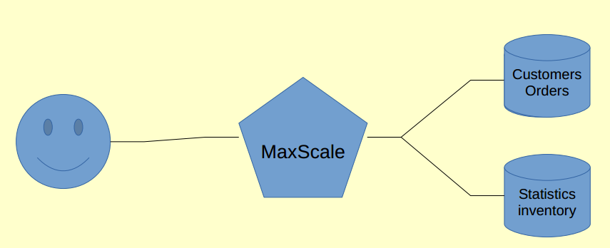

# Simple Sharding with Two Servers



Sharding is the method of splitting a single database server into separate parts. This tutorial describes a very simple way of sharding. Each schema is located on a different database server and MariaDB MaxScale's **schemarouter** module is used to combine them into a single database server.

MariaDB MaxScale will appear to the client as a database server with the combination of all the schemas in all the configured servers.

## Environment & Solution Space

This document is designed as a simple tutorial on schema-based sharding using MariaDB MaxScale in an environment in which you have two servers. The object of this tutorial is to have a system that, to the client side, acts like a single MariaDB database but actually is sharded between the two servers.

The database users should be configured according to [the configuration guide](../Getting-Started/Configuration-Guide.md). The [MaxScale Tutorial](MaxScale-Tutorial.md) contains easy to follow instructions on how to set up MaxScale.

This tutorial will assume the user is using of the binary distributions available and has installed this in the default location. The process of configuring MariaDB MaxScale will be covered within this document. The installation and configuration of the MariaDB servers will not be covered in-depth.

## Preparing MaxScale

Follow the [MaxScale Tutorial](MaxScale-Tutorial.md) to install and prepare the required database users for MaxScale. You don't need to create the configuration file  for MaxScale as it will be covered in the next section.

### Creating Your MariaDB MaxScale Configuration

The first step in the creation of your maxscale.cnf file is to define the global maxscale section. This section configures the number of threads MariaDB MaxScale uses. A good rule of thumb is to use at most as may threads as you have CPUs. MariaDB MaxScale uses few threads for internal operations so one or two threads less than the maximum should be enough.

```
[maxscale]
threads=8
```

After this we configure two servers we will use to shard our database. The `accounts_east` server will hold one schema and the `accounts_west` will hold another schema. We will use these two servers to create our sharded database.

```
[accounts_east]
type=server
address=192.168.56.102
port=3306

[accounts_west]
type=server
address=192.168.122.85
port=3306
```

The next step is to configure the service which the users connect to. This section defines which router to use, which servers to connect to and the credentials to use. The router we use in this tutorial is the `schemarouter`.

```
[Sharded Service]
type=service
router=schemarouter
servers=accounts_west,accounts_east
user=sharduser
passwd=YqztlYGDvZ8tVMe3GUm9XCwQi
```

After this we configure a listener for the service. The listener is the actual port the user connects to. We will use the port 4000.

```
[Sharded Service Listener]
type=listener
service=Sharded Service
protocol=MySQLClient
port=4000
```

The final step is to configure a monitor which will monitor the state of the servers. The monitor will notify MariaDB MaxScale if the servers are down. We add the two servers to the monitor, define the credentials to use and we set the monitoring cycle interval.

```
[MySQL Monitor]
type=monitor
module=mysqlmon
servers=accounts_west,accounts_east
user=monitoruser
passwd=7SP1Zcsow8TG+9EkEBVEbaKa
monitor_interval=1000
```

After this we have a fully working configuration and we can move on to starting MariaDB MaxScale.

## Starting MariaDB MaxScale

Upon completion of the configuration process MariaDB MaxScale is ready to be started . This may either be done manually by running the maxscale command or via the service interface. The service scripts are located in the `/etc/init.d/` folder and are accessible through both the `service` and `systemctl` commands.

MariaDB MaxScale is now ready to start accepting client connections and routing them. Queries are routed to the right servers based on the database they target and switching between the shards is seamless since MariaDB MaxScale keeps the session state intact between servers.

If MariaDB MaxScale fails to start, check the error log in `/var/log/maxscale` to see what sort of errors were detected.

**Note:** As the sharding solution in MaxScale is relatively simple, cross-database queries between two or more shards are not supported.
