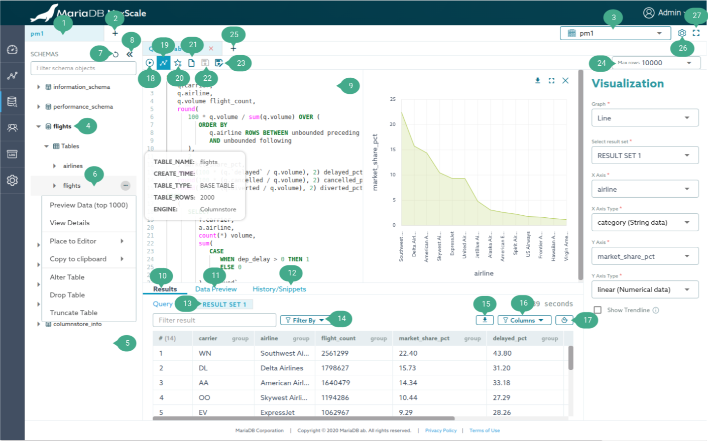

# Using MaxGUI Tutorial

[TOC]

# Introduction

This tutorial is an overview of what the MaxGUI offers as an alternative
solution to [MaxCtrl](../Reference/MaxCtrl.md).

# Dashboard

## Annotation

1.  [MaxScale object](../Getting-Started/Configuration-Guide.md#objects). i.e.
    Service, Server, Monitor, Filter, and Listener (Clicking on it will navigate
    to its detail page)
2.  Create a new MaxScale object.
3.  Dashboard Tab Navigation.
4.  Search Input. This can be used as a quick way to search for a keyword in
    tables.
5.  Dashboard graphs. Refresh interval is 10 seconds.
    - SESSIONS graph illustrates the total number of current sessions.
    - CONNECTIONS graph shows servers current connections.
    - LOAD graph shows the last second load of thread.
6.  Logout of the app.
7.  Sidebar navigation menu. Access to the following pages: Dashboard,
    Visualization, Settings, Logs Archive, Query Editor

## Create a new MaxScale object

Clicking on the _Create New_ button (Annotation 2) to open a dialog for creating
a new object.

## View Replication Status

The replication status of a server monitored by
[MariaDB-Monitor](../Monitors/MariaDB-Monitor.md) can be viewed by mousing over
the server name. A tooltip will be displayed with the following information:
replication_state, seconds_behind_master, slave_io_running, slave_sql_running.

# Detail

This page shows information on each MaxScale object and allow to edit its
parameter, relationships and perform other manipulation operations. Most of the
control buttons will be shown on the mouseover event. Below is a screenshot of a
Monitor Detail page, other Detail pages also have a similar layout structure so
this is used for illustration purpose.

## Annotation

1.  Settings option. Clicking on the gear icon will show icons allowing to do
    different operations depending on the type of the Detail page.
    - Monitor Detail page, there are icons to Stop, Start, and Destroy monitor.
    - Service Detail page, there are icons to Stop, Start, and Destroy service.
    - Server Detail page, there are icons to Set maintenance mode, Clear server
      state, Drain and Delete server.
    - Filter and Listener Detail page, there is a delete icon to delete the
      object.
2.  Switchover button. This button is shown on the mouseover event allowing to
    swap the running primary server with a designated secondary server.
3.  Edit parameters button. This button is shown on the mouseover event allowing
    to edit the MaxScale object's parameter. Clicking on it will enable editable
    mode on the table. After finishing editing the parameters, simply click the
    _Done Editing_ button.
4.  A Detail page has tables showing "Relationship" between other MaxScale
    object. This "unlink" icon is shown on the mouseover event allowing to
    remove the relationship between two objects.
5.  This button is used to link other MaxScale objects to the relationship.

# Visualization

This page visualizes MaxScale configuration and clusters.

## Clusters

This page shows all monitor clusters using
[mariadbmon](../Monitors/MariaDB-Monitor.md) module in a card-like view.
Clicking on the card will visualize the cluster into a tree graph as shown in
the figure below.

### Annotation

1.  Drag a secondary server on top of a primary server to promote the secondary
    server as the new primary server.
2.  Server manipulation operations button. Showing a dropdown with the following
    operations:
    - Set maintenance mode: Setting a server to a maintenance mode.
    - Clear server state: Clear current server state.
    - Drain server: Drain the server of connections.
3.  Quick access to query editor button. Opening the `Query Editor` page for
    this server. If the connection is already created for that server, it'll use
    it. Otherwise, it creates a blank worksheet and shows a connection dialog to
    connect to that server.
4.  Carousel navigation button. Viewing more information about the server in the
    next slide.
5.  Collapse the carousel.
6.  Anchor link of the server. Opening the detail page of the server in a new
    tab.
7.  Collapse its children nodes.
8.  Monitor manipulation operations button. Showing a dropdown with the
    following operations:
    - Stop monitor.
    - Start monitor.

# Settings

This page shows and allows editing of MaxScale parameters.

## Annotation

1.  Edit parameters button. This button is shown on the mouseover event allowing
    to edit the MaxScale parameter. Clicking on it will enable editable mode on
    the table..
2.  Editable parameters are visible as it's illustrated in the screenshot.
3.  After finishing editing the parameters, simply click the _Done Editing_
    button.

# Logs Archive

This page show real-time MaxScale logs with filter options.

## Annotation

1.  Filter by dropdown. All logs types are selected to be shown by default
2.  Uncheck the box to disable showing a particular log type.

# Query Editor

A SQL editor tool to run queries and perform other SQL operations.

## Annotation

1.  Worksheet tab navigation. Each worksheet is bound to a connection, so
    sessions querying within a worksheet is not yet supported.
2.  Add a new worksheet button.
3.  Connection manager dropdown. With this dropdown, you can create a new
    connection or change the connection for the current active worksheet. A new
    connection can be created by selecting the last option in the dropdown
    labeled as `New connection`. Once a connection is created, it automatically
    binds the connection to the current active worksheet.
4.  Active database dropdown. Allowing to quickly change the default (current)
    database.
5.  Schemas sidebar. Showing available schemas on the current connection. As
    shown in the figure above, these items can be explored to show tables,
    stored procedures, columns, and triggers within the schema.
6.  Schemas sidebar object.
    - Each object has its own context menu providing different options. e.g. For
      the table object as shown in the figure above, it has options to
      `Preview Data (top 1000)` and `View Details`. The query result for these
      options is shown in the `Data Preview` result tab which is annotated as
      number 12. The context menu can be shown by right-clicking on the object
      or clicking on the three dots icon placed on the right side of the object.
    - Quick access to the `Preview Data (top 1000)` context menu option. For a
      table object, its preview data can also be seen by clicking on its name.
    - Quick overview tooltip. Each object has its own tooltip providing an
      overview of the object.
7.  Refresh schema objects button. After deleting or creating schema object, the
    `Schemas sidebar` needs to be manually refreshed.
8.  Collapse the `Schemas sidebar` button.
9.  SQL editor. The editor is powered by
    [Monaco editor](https://microsoft.github.io/monaco-editor/) which means its
    functionalities are similar to VS code. Available commands can be seen by
    pressing F1 while the cursor is active on the editor. This is an intention
    to prevent conflict between the browser's shortcut keys and the SQL
    editor's. This also means the editor shortcut key commands are valid only
    when the cursor is active on the `SQL editor` with an exception for the
    `Run all statements`, `Run selected statements` and
    `Save statements to favorite` commands.
10. Run button. Running the queries written in the `SQL editor`. Alternatively,
    pressing `Ctrl/CMD+Shift+Enter` to `Run all statements` or `Ctrl/CMD+Enter`
    to `Run selected statements`.
11. Query Results. Showing the query results of queries written in the SQL
    editor.
12. Data Preview. Showing the query results of `Preview Data (top 1000)` and
    `View Details` options of the schema sidebar context menu.
13. History/Favorite. Showing query history and favorite queries.
14. Result tab navigation. Navigating between SQL queries results.
15. Filter query history logs. The query history is divided into two types of
    logs The `User query logs` contains logs for queries written in the
    `SQL editor` while the `Action logs` contains logs for auto-generated SQL,
    such as `Preview Data (top 1000)`, `View Details`, `Drop Table` and
    `Truncate Table`.
16. Export query result button. Exporting as `json`, `csv` with a custom
    delimiter.
17. Filter query result columns dropdown. Selecting columns to be visible.
18. Vertical query result button. Switching to vertical mode.
19. Visualize query result button. Visualizing a query result into a line,
    scatter, vertical bar, and horizontal bar graph.
20. Export graph as a jpeg file.
21. [sql_select_limit](https://mariadb.com/docs/reference/mdb/system-variables/sql_select_limit/)
    input. Changing the maximum number of rows to return from SELECT statements.
22. Save SQL queries to the favorite button. Saving queries written in the
    `SQL editor`. Alternatively, press `Ctrl/CMD+S`.
23. Query Editor settings button. Open `Query configuration` dialog to change
    the value of `Max rows` (sql_select_limit),
    `Query history retention period (in days)`,
    `Show confirmation before executing the statements` and
    `Show system schemas`.
24. Maximize Query Editor window.
