# Using MaxGUI Tutorial

[TOC]

# Introduction

This tutorial is an overview of what the MaxGUI offers as an alternative
solution to [MaxCtrl](../Reference/MaxCtrl.md).

# Dashboard

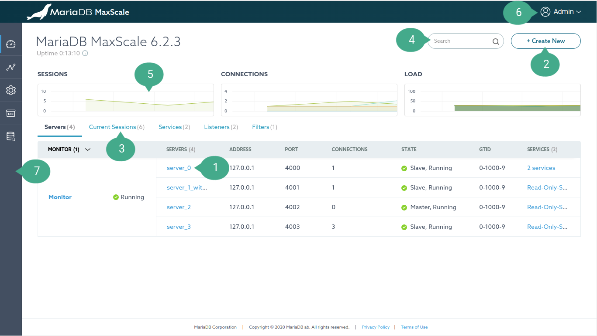

## Annotation

1.  [MaxScale object](../Getting-Started/Configuration-Guide.md#objects). i.e.
    Service, Server, Monitor, Filter, and Listener (Clicking on it will navigate
    to its detail page)
2.  Create a new MaxScale object.
3.  Dashboard Tab Navigation.
4.  Search Input. This can be used as a quick way to search for a keyword in
    tables.
5.  Dashboard graphs. Refresh interval is 10 seconds.
    - SESSIONS graph illustrates the total number of current sessions.
    - CONNECTIONS graph shows servers current connections.
    - LOAD graph shows the last second load of thread.
6.  Logout of the app.
7.  Sidebar navigation menu. Access to the following pages: Dashboard,
    Visualization, Settings, Logs Archive, Query Editor

## Create a new MaxScale object

Clicking on the _Create New_ button (Annotation 2) to open a dialog for creating
a new object.

## View Replication Status

The replication status of a server monitored by
[MariaDB-Monitor](../Monitors/MariaDB-Monitor.md) can be viewed by mousing over
the server name. A tooltip will be displayed with the following information:
replication_state, seconds_behind_master, slave_io_running, slave_sql_running.

## How to kill a session

A session can be killed easily on the "Current Sessions" list which can be
found on the [Dashboard](#dashboard), Server detail, and Service detail page.

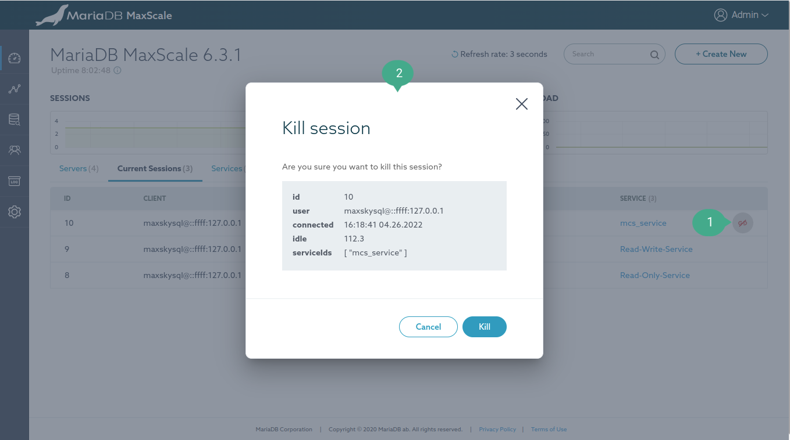

### Annotation

1. Kill session button. This button is shown on the mouse hover.
2. Confirm killing the session dialog.

# Detail

This page shows information on each MaxScale object and allow to edit its
parameter, relationships and perform other manipulation operations. Most of the
control buttons will be shown on the mouse hover. Below is a screenshot of a
Monitor Detail page, other Detail pages also have a similar layout structure so
this is used for illustration purpose.

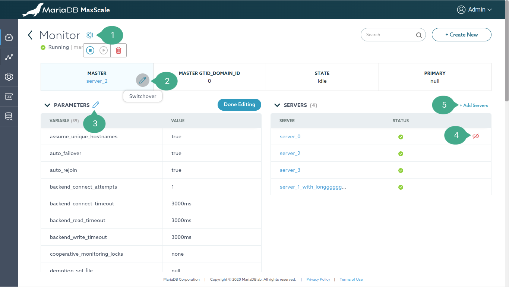

## Annotation

1.  Settings option. Clicking on the gear icon will show icons allowing to do
    different operations depending on the type of the Detail page.
    - Monitor Detail page, there are icons to Stop, Start, and Destroy monitor.
    - Service Detail page, there are icons to Stop, Start, and Destroy service.
    - Server Detail page, there are icons to Set maintenance mode, Clear server
      state, Drain and Delete server.
    - Filter and Listener Detail page, there is a delete icon to delete the
      object.
2.  Switchover button. This button is shown on the mouse hover allowing to
    swap the running primary server with a designated secondary server.
3.  Edit parameters button. This button is shown on the mouse hover allowing
    to edit the MaxScale object's parameter. Clicking on it will enable editable
    mode on the table. After finishing editing the parameters, simply click the
    _Done Editing_ button.
4.  A Detail page has tables showing "Relationship" between other MaxScale
    object. This "unlink" icon is shown on the mouse hover allowing to
    remove the relationship between two objects.
5.  This button is used to link other MaxScale objects to the relationship.

# Visualization

This page visualizes MaxScale configuration and clusters.

## Configuration

This page visualizes MaxScale configuration as shown in the figure below.

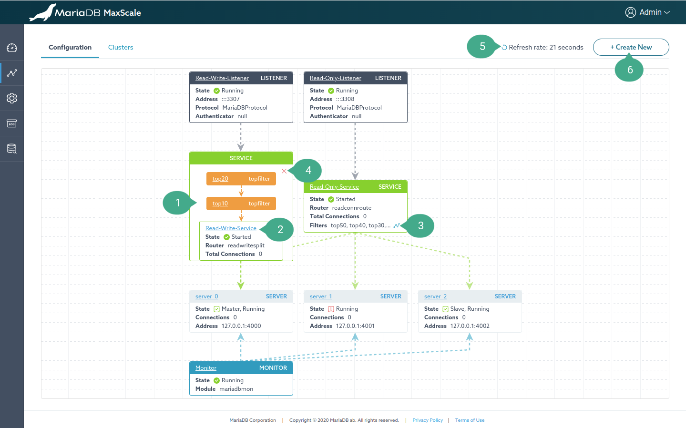

### Annotation

1.  A MaxScale object (a node graph). The position of the node in the graph can
    be changed by dragging and dropping it.
2.  Anchor link. The detail page of each MaxScale object can be accessed by
    clicking on the name of the node.
3.  Filter visualization button. By default, if the number of filters used by a
    service is larger than 3, filter nodes aren't visualized as shown in the
    figure. Clicking this button will visualize them.
4.  Hide filter visualization button.
5.  Refresh rate dropdown. The frequency with which the data is refreshed.
6.  Create a new MaxScale object button.

## Clusters

This page shows all monitor clusters using
[mariadbmon](../Monitors/MariaDB-Monitor.md) module in a card-like view.
Clicking on the card will visualize the cluster into a tree graph as shown in
the figure below.

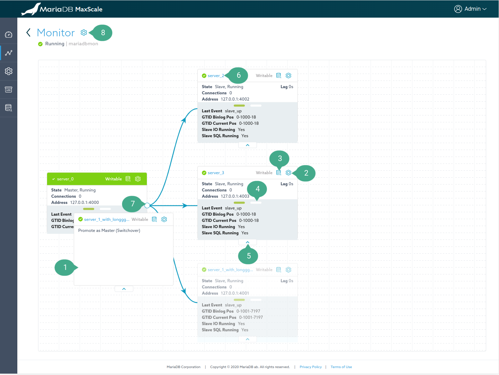

### Annotation

1.  Drag a secondary server on top of a primary server to promote the secondary
    server as the new primary server.
2.  Server manipulation operations button. Showing a dropdown with the following
    operations:
    - Set maintenance mode: Setting a server to a maintenance mode.
    - Clear server state: Clear current server state.
    - Drain server: Drain the server of connections.
3.  Quick access to query editor button. Opening the `Query Editor` page for
    this server. If the connection is already created for that server, it'll use
    it. Otherwise, it creates a blank worksheet and shows a connection dialog to
    connect to that server.
4.  Carousel navigation button. Viewing more information about the server in the
    next slide.
5.  Collapse the carousel.
6.  Anchor link of the server. Opening the detail page of the server in a new
    tab.
7.  Collapse its children nodes.
8.  Rejoin node. When the `auto_rejoin` parameter is disabled, the node can be
    manually rejoined by dragging it on top of the primary server.
9.  Monitor manipulation operations button. Showing a dropdown with the
    following operations:
    - Stop monitor.
    - Start monitor.
    - Reset Replication.
    - Release Locks.
    - Master failover. Manually performing a primary failover. This option is
      visible only when the `auto_failover` parameter is disabled.
10. Refresh rate dropdown. The frequency with which the data is refreshed.
11. Create a new MaxScale object button.

# Settings

This page shows and allows editing of MaxScale parameters.

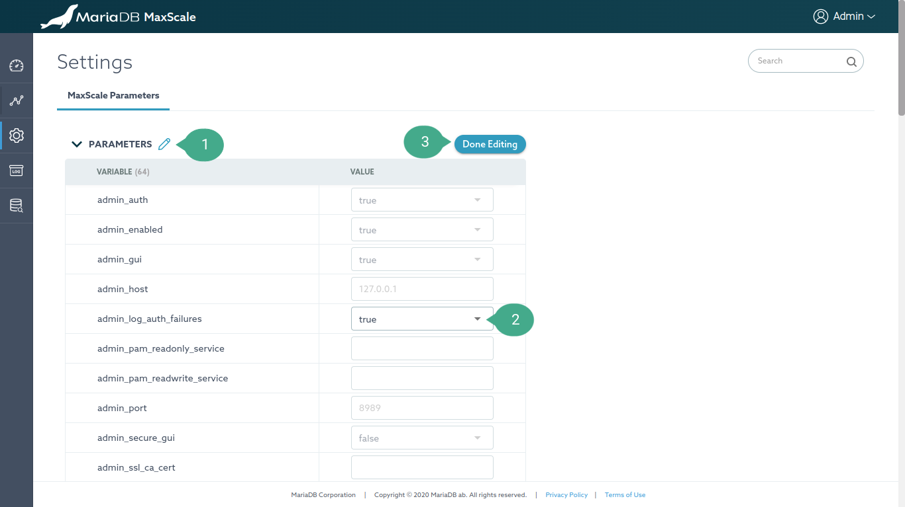

## Annotation

1.  Edit parameters button. This button is shown on the mouse hover allowing
    to edit the MaxScale parameter. Clicking on it will enable editable mode on
    the table..
2.  Editable parameters are visible as it's illustrated in the screenshot.
3.  After finishing editing the parameters, simply click the _Done Editing_
    button.

# Logs Archive

This page show real-time MaxScale logs with filter options.

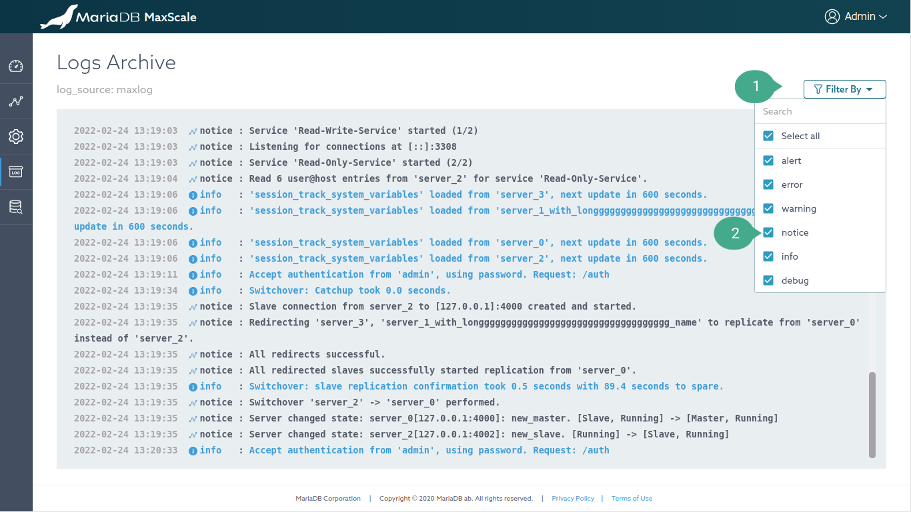

## Annotation

1.  Filter by dropdown. All logs types are selected to be shown by default
2.  Uncheck the box to disable showing a particular log type.

# Workspace

On this page, you may add numerous worksheets, each of which can be used for
"Run queries", "Data migration" or "Create an ERD" task.

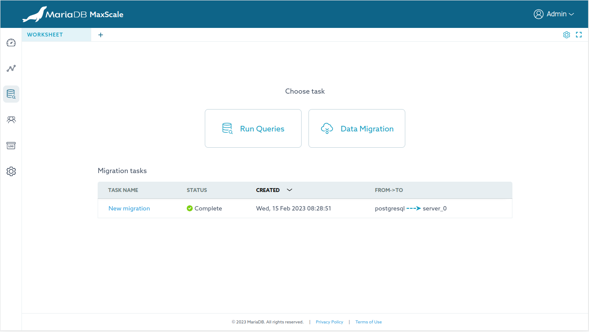

## Run Queries

Clicking on the "Run Queries" card will open a dialog, providing options
to establish a connection to different MaxScale object types, including
"Listener, Server, Service".

The Query Editor worksheet will be rendered in the active worksheet after correctly connecting.

### Query Editor worksheet

There are various features in the Query Editor worksheet, the most notable ones are listed below.

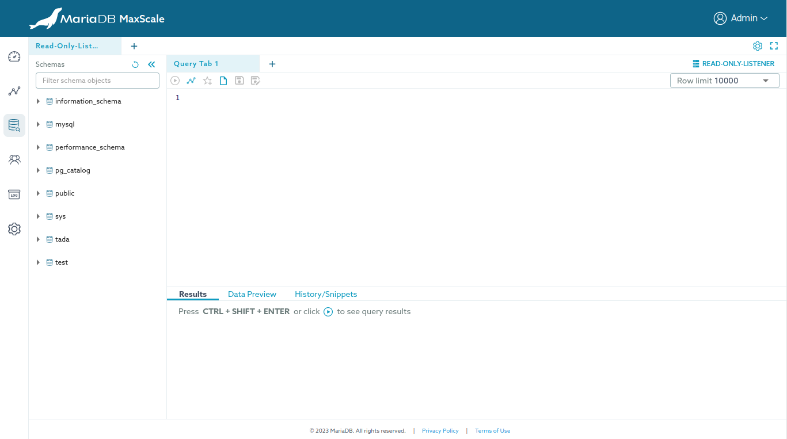

#### Create a new connection

If the connection of the Query Editor expires, or if you wish to make
a new connection for the active worksheet, simply clicking on the button
located on the right side of the query tabs navigation bar which features a
server icon and an active connection name as a label. This will open the
connection dialog and allow you to create a new connection.

#### Schemas objects sidebar

##### Set the current database

There are two ways to set the current database:

- Double-click on the name of the database.
- Right-click on the name of the database to show the context menu, then select
  the `Use database` option.

##### Preview table data of the top 1000 rows

There are two ways to preview data of a table:

- Click on the name of the table.
- Right-click on the name of the table to show the context menu, then select
  the `Preview Data (top 1000)` option.

##### Describe table

Right-click on the name of the table to show the context menu, then select the
`View Details` option.

##### Alter/Drop/Truncate table

Right-click on the name of the table to show the context menu, then select the
desired option.

##### Quickly insert an object into the editor

There are two ways to quickly insert an object to the editor:

- Drag the object and drop it in the desire position in the editor.
- Right-click on the object to show the context menu, then mouse
  hover the `Place to Editor` option and select the desired insert option.

##### Show object creation statement and insights info

To view the statement that creates the given object in the [Schemas objects sidebar](#schemas-objects-sidebar), right-clicking on schema or table node and
select the `View Insights` option. For other objects such as view, stored
procedure, function and trigger, select the `Show Create` option.

#### Editor

The editor is powered by [Monaco editor](https://microsoft.github.io/monaco-editor/), therefore, its features are similar to those of
Visual Studio Code.

To see the command palette, press F1 while the cursor is active on the editor.

The editor also comes with various options to assist your querying tasks. To see
available options, right-click on the editor to show the context menu.

#### Re-execute old queries

Every executed query will be saved in the browser's storage (IndexedDB).
Query history can be seen in the `History/Snippets` tab.
To re-execute a query, follow the same step to [insert an object into the editor](#quickly-insert-an-object-into-the-editor)
and click the execute query button in the editor.

#### Create query snippet

Press CTRL/CMD + D to save the current SQL in the editor to the snippets storage.
A snippet is created with a prefix keyword, so when that keyword is typed in
the editor, it will be suggested in the "code completion" menu.

#### Generate an ERD

To initiate the process, either right-click on the schema name and select the
`Generate ERD` option, or click on the icon button that resembles a line graph,
located on the schemas sidebar. This will open a dialog for selecting the
tables for the diagram.

## Data Migration

Clicking on the "Data Migration" card will open a dialog, providing an option
to name the task. The Data Migration worksheet will be rendered in the active
worksheet after clicking the `Create` button in the dialog.

### Data Migration worksheet

MaxScale uses ODBC for extracting and loading from the data source to a server
in MaxScale. Before starting a migration, ensure that you have set up the
necessary configurations on the MaxScale server. Instruction can be found [here](../REST-API/Resources-SQL.md#prepare-etl-operation)
and limitations [here](../About/Limitations.md#etl-limitations).

#### Connections

Source connection shows the most common parameter inputs for creating
an ODBC connection. For extra parameters, enable the `Advanced` mode
to manually edit the `Connection String` input.

After successfully connected to both source and destination servers,
click on the `Select objects to migrate` to navigate to the next stage.

#### Objects Selection

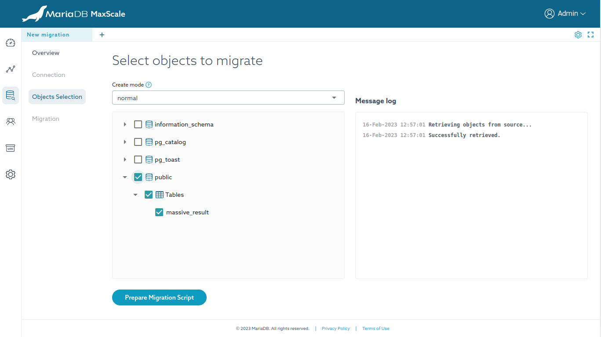

Select the objects you wish to migrate to the MariaDB server.

After selecting the desired objects, click on the `Prepare Migration Script` to
navigate to the next stage. The migration scripts will be generated
differently based on the value selected for the `Create mode` input. Hover over
the question icon for additional information on the modes.

#### Migration

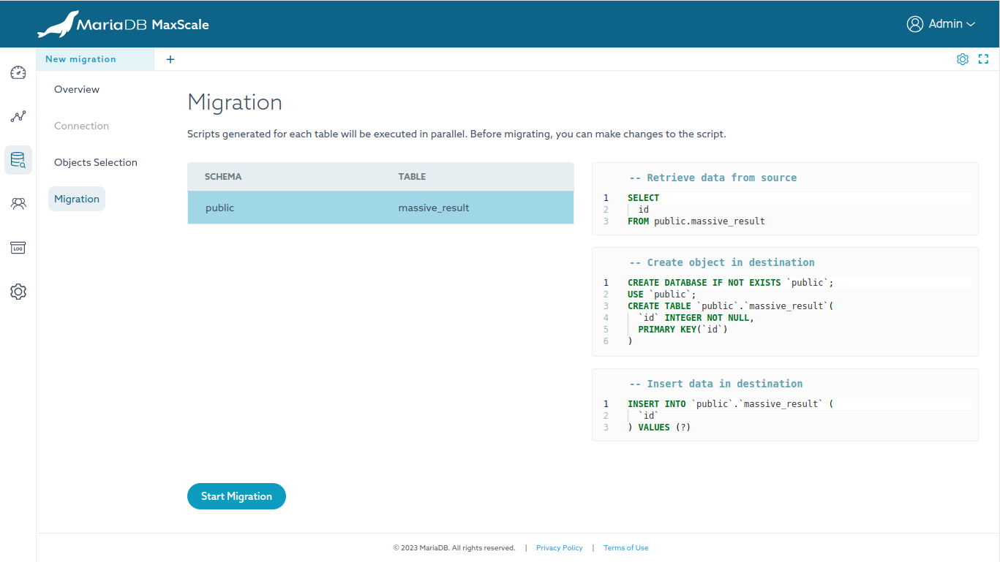

As shown in the screenshot, you can quickly modify the script for each object
by selecting the corresponding object in the table and using the editors on the
right-hand side to make any necessary changes.

After clicking the `Start Migration` button, the script for each object will be
executed in parallel.

#### Migration report

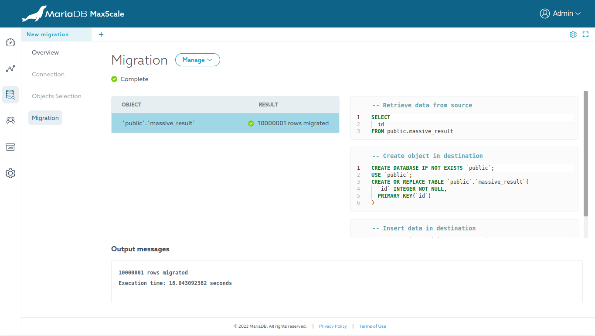

If errors are reported for certain objects, review the output messages and
adjust the script accordingly. Then, click the `Manage` button and select `Restart`.

To migrate additional objects, click the `Manage` button and select
`Migrate other objects`. Doing so will replace the current migration
report for the current object with a new one.

To retain the report and terminate open connections after migration, click the
`Manage` button, then select `Disconnect`, and finally delete the worksheet.

Deleting the worksheet will not delete the migration task. To clean-up
everything after migration, click the `Manage` button, then select
`Delete`.

## Create an ERD

There are various features in the ERD worksheet, the most notable ones are
listed below.

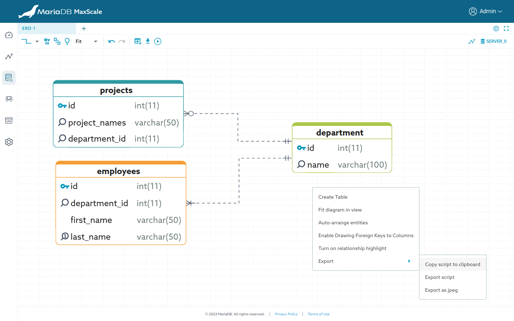

### ERD worksheet

From an empty new worksheet, clicking on the "Create an ERD" card will open a
connection dialog. After connecting successfully, the ERD worksheet will be
rendered in the active worksheet. The connection is required to retrieve
essential metadata, such as engines, character sets, and collation.

#### Generate an ERD from the existing databases

Click on the icon button featured as a line graph, located on the top
toolbar next to the connection button. This will open a dialog for selecting
the tables for the diagram.

#### Create a new ERD

New tables can be created by using either of the following methods:

- Click on the icon button that resembles a line graph, located on the
  top toolbar.
- Right-click on the diagram board and select the `Create Table`
  option.

#### Entity options

Two options are available: `Edit Table` and `Remove from Diagram`. These
options can be accessed using either of the following methods:

- Right-click on the entity and choose the desired option.
- Hover over the entity, click the gear icon button, and select the desired
  option.

For quickly editing or viewing the table definitions, double-clicking on the
entity. The entity editor will be shown at the bottom of the worksheet.

#### Foreign keys quick common options

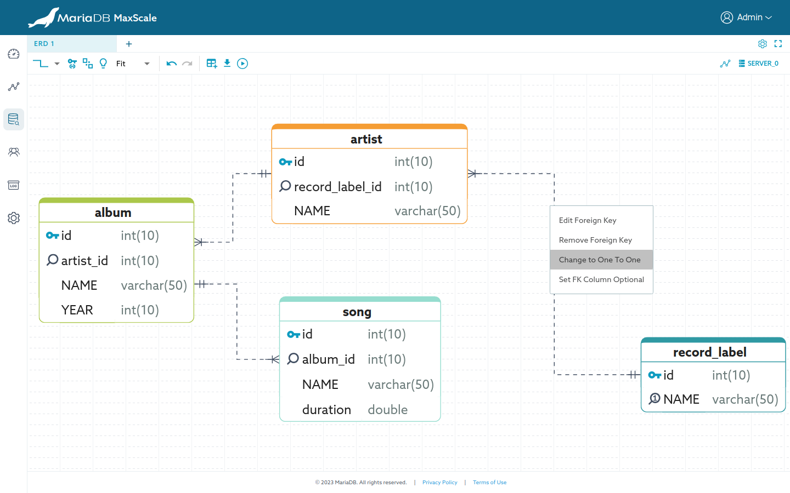

- Edit Foreign Key, this opens an editor for viewing/editing foreign keys.
- Remove Foreign Key.
- `Change to One To One` or `Change to One To Many`. Toggling the uniqueness
  of the foreign key column.
- `Set FK Column Mandatory` or `Set FK Column Optional`. Toggling the
  `NOT NULL` option of the foreign key column.
- `Set Referenced Column Mandatory` or `Set Referenced Column Optional`
  Toggling the `NOT NULL` option of the referenced column.

To show the above foreign key common options, perform a right-click on the link
within the diagram.

#### Viewing foreign key constraint SQL

Hover over the link in the diagram, the constraint SQL of that foreign key will
be shown in a tooltip.

#### Quickly draw a foreign key link

As shown in the screenshot, a foreign key can be quickly established by
performing the following actions:

1. Click on the entity that will have the foreign key.
2. Click on the connecting point of the desired foreign key column and drag
   it over the desired referenced column.

#### Entity editor

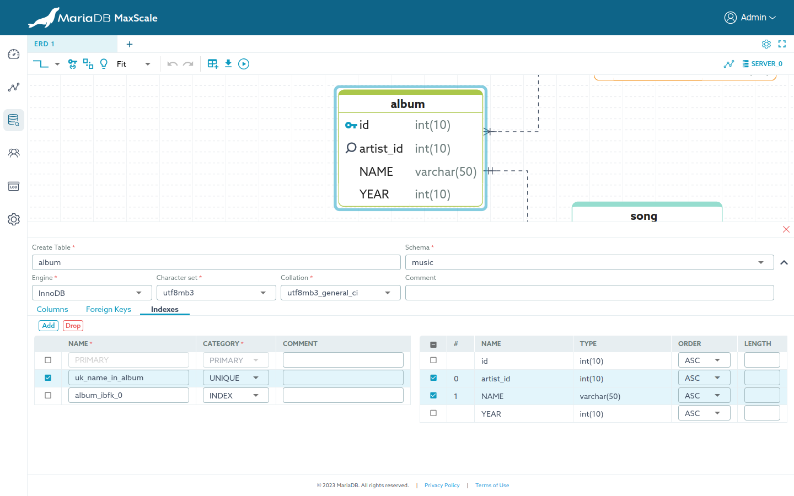

Table columns, foreign keys and indexes can be modified via
the entity editor which can be accessed quickly by double-clicking
on the entity.

#### Export options

Three options are available: `Copy script to clipboard`, `Export script` and
`Export as jpeg`. These options can be accessed using either of the following
methods:

- Right-click on the diagram board and choose the desired option.
- Click the export icon button, and select the desired option.

#### Applying the script

Click the icon button resembling a play icon to execute the generated script
for all tables in the diagram. This action will prompt a confirmation dialog
for script execution. If needed, the script can be manually edited using the
editor within the dialog.

#### Visual Enhancement options

The first section of the top toolbar, there are options to improve the visual of
the diagram as follows:

- Change the shape of links
- Drawing foreign keys to columns
- Auto-arrange entities
- Highlight relationship
- Zoom control
