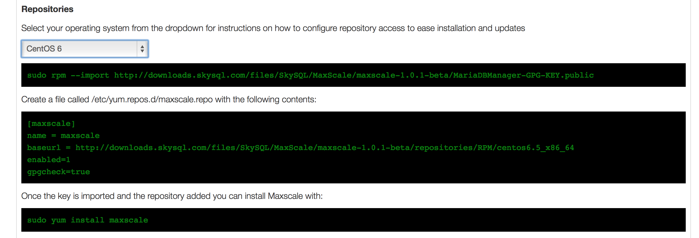

# Getting Started With MariaDB MaxScale

## First Steps With MaxScale

In this introduction to MaxScale the aim is to take the reader from the point of installation to making the decision as to which of the various setups that are possible with MaxScale should be the initial configuration to use. One of the problems that new users to MaxScale suffer is deciding exactly what they should consider as a base configuration to start exploring what MaxScale is capable of. MaxScale is highly configurable, with new plugins expanding the capabilities of MaxScale, whilst this makes it a very adaptable tool it does lead to an initial hurdle in configuring MaxScale.

## Installation

The simplest way to install MaxScale is to use one of the binary packages that are available for download from the MariaDB website.

* Simply go to [www.mariadb.com](http://www.mariadb.com)

* Select the Downloads option from the Resources menu

* Find and click on the button "Download MariaDB MaxScale Binaries"

* Find the section on that page entitled MariaDB MaxScale

* Select your operating system from the drop down box

* Instructions that are specific for your operating system will then appear

* Follow these instructions to install MaxScale on your machine

Upon successful completion of the installation process you have a version of MaxScale that is missing only a configuration file before it can be started.

## Building MaxScale From Source Code

Alternatively you may download the MaxScale source and build your own binaries. To do this, refer to the separate document [Building MaxScale from Source Code](/Documentation/Getting-Started/Building-MaxScale-from-Source-Code.md)

## Configuring MaxScale

The first step in configuring your MaxScale is to determine what it is you want to achieve with your MaxScale and what environment it will run in. The later is probably the easiest starting point for choosing which configuration route you wish to take. There are two distinct database environments which the first GA release of MaxScale supports; MySQL Master/Slave Replication clusters and Galera Cluster.

### Master/Slave Replication Clusters

There are two major configuration options available to use MaxScale with a MySQL Replication cluster; connection routing with separate read and write connections, or read/write splitting with a single connection. A separate tutorial is available for each of these configurations that describes how to build the configuration file for MaxScale that will work with your environment.

Using a MySQL Master/Slave Replication cluster will provide one node server within the cluster that is the master server and the remainder of the servers will be slaves. The slaves are read replicas of the master. In a replication cluster like this all write operations must be performed on the master. This can provide not just added security of your data, but also read scalability. In an application environment with a substantial proportions of read operations, directing those read operations to the slave servers can increase the total load which the system can handle by offloading the master server from the burden of these read operations.

Making the choice between these two setups is relatively simple, if you have an application that understands that there are some database servers that it can only read from and one it must send all of the writes to, then the connection routing option can be used. Applications that are not written to separate read and write statements must use a service within MaxScale that will split the incoming stream of SQL statements into operations that can be executed on the master and those that can be set to the slave. These applications should use the statement based routing provided by the Read/Write Splitter router.

### Galera Cluster

A Galera Cluster provides a true multi-master cluster option for MariaDB and MySQL database environments. In such a setup any node that is part of the cluster can be used to both execute read and write operations. MaxScale again offers two different configurations that can be used with Galera; a connection balancing configuration or a statement splitting mechanism that can be used to isolate write operations to a single node within the cluster. Again there is a tutorial guide available for both of these major configurations.

The connection based load balancing configuration is used in an environment in which you have a cluster that you want to be available to an application without the application needing to be aware of the cluster configuration or state of the database nodes. MaxScale will monitor the nodes within the database cluster and will route connections from the application to database nodes that are active members of the cluster. MaxScale will also keep track of the number of connections to each database node keep equal numbers of connections to each node, at the time the connection is established.

It is also possible to use the Read/Write Splitter with Galera. Although it is not necessary to segregate the write operations to a single node, there are advantages in doing this if you have an application where the write load is not too great to be handled by a single node in the cluster. Galera Cluster uses an optimistic locking strategy that will allow transactions to progress independently on each node within the cluster. It is only when the transaction commits that the transaction is checked for conflicts with other transactions that are committing on the other nodes. At this stage the commit can fail with a deadlock detection error. This can be inconvenient for applications and, some older applications, that are not aware that the transaction can fail at this stage may not check for this failure. Using the Read/Write Splitter will allow this to be avoided since it will isolate the write to one node and no deadlock detection will occur. MaxScale provides a monitoring module that will maintain pseudo states of master and slave for the Galera cluster that allows for this type of configuration.

### Other MaxScale Configuration

As well as the four major configuration choices outlined above there are also other configurations sub-options that may be mixed with those to provide a variety of different configuration and functionality. The MaxScale filter concept allows the basic configurations to be built upon in a large variety of ways. A separate filter tutorial is available that discusses the concept and gives some examples of ways to use filters.

## Running MaxScale

MaxScale consists of a core executable and a number of modules that implement
the different protocols and routing algorithms. These modules are built as
shared objects that are loaded on demand. In order for MaxScale to find these
modules it will search using a configurable search path. The priority of these paths are:

 1. Look in the directory defined with --libdir=PATH during startup
 2. Look in the directory defined with libdir=PATH in the configuration file under the [maxscale] section
 3. Look in default directory in /usr/lib64/maxscale

Configuration is read by default from the file /etc/MaxScale.cnf. An example file is included in in the installation and can be found in the /usr/share/maxscale folder within the MaxScale installation. The -f flag can be used on the command line to set the name and the location of the configuration file. The -C flag can be used to set the directory where the configuration file is searched for. Without the -f or -C flags, the file is read from the /etc directory.

## Administration Of MaxScale

There are various administration tasks that may be done with MaxScale, a client command, maxadmin, is available that will interact with a running MaxScale and allow the status of MaxScale to be monitored and give some control of the MaxScale functionality. There is a separate reference guide for the maxadmin utility and also a short administration tutorial that covers the common administration tasks that need to be done with MaxScale.

